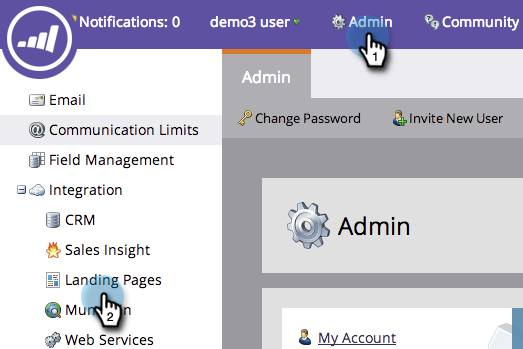
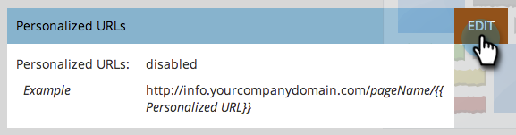

# Enable Personalized URLs for Your Account {#enable-personalized-urls-for-your-account}

Personalized URLs are great for print mail campaigns.

>[!NOTE]
>
>**Admin Permissions Required**

1. Go to the **Admin** section and click **Landing Pages**.

   

1. Click **Edit**.

   

1. Check the **Enable Personalized URLs** box and click **Save**.

   

Great job! Now that you have enabled PURLs for your account, you can enable it for individual landing pages.

>[!NOTE]
>
>If two people have the same first and/or last names, the system will automatically append a number to the end of their PURL name.
>
>Example:
>
>1. AnnaJones
>1. AnnaJones2
>1. AnnaJones3
