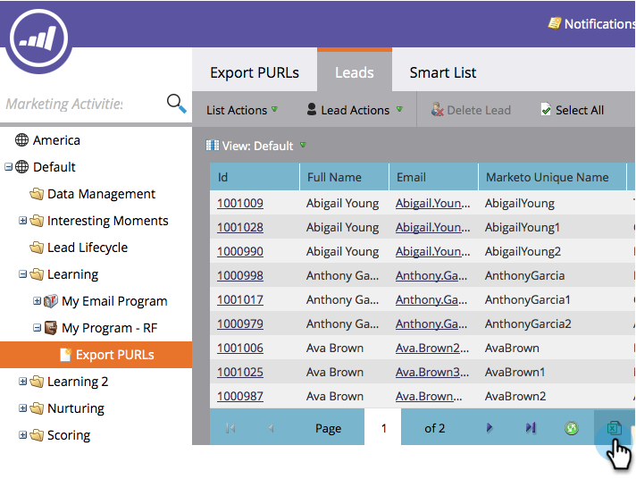
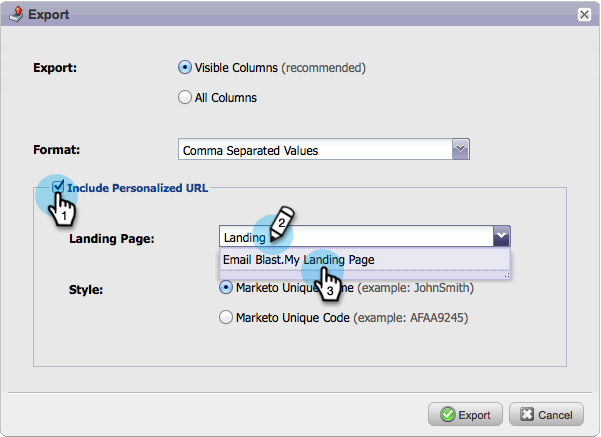
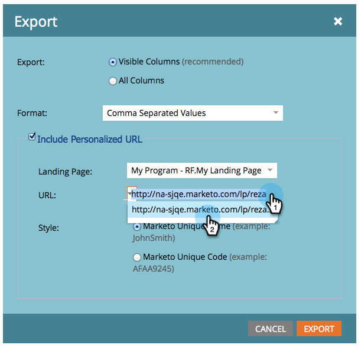
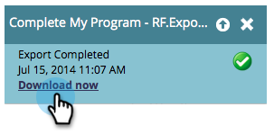
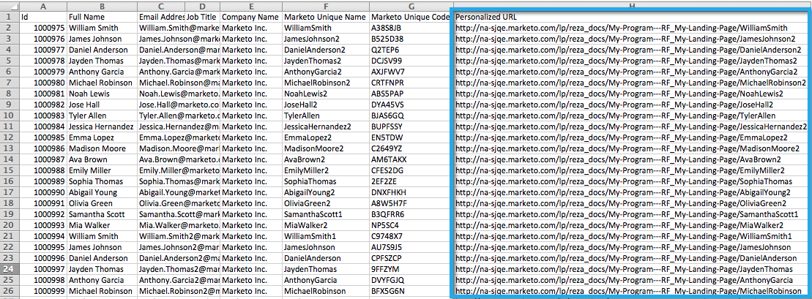

# Export a List with Personalized URLs {#export-a-list-with-personalized-urls}

>[!PREREQUISITES]
>
>* [Enable Personalized URLs for Your Account](/help/marketo/product-docs/demand-generation/landing-pages/personalizing-landing-pages/enable-personalized-urls-for-your-account.md)
>* [Enable Personalized URLs for a Landing Page](/help/marketo/product-docs/demand-generation/landing-pages/personalizing-landing-pages/enable-personalized-urls-for-a-landing-page.md)

1. Select your list or smart list, click on the **Leads** tab to get the results and then click on the excel icon. INLINE Make sure you have **Marketo Unique Code** and **Marketo Unique Name** [columns visible](/help/marketo/product-docs/core-marketo-concepts/smart-lists-and-static-lists/using-smart-lists/create-and-change-views-for-lists-and-smart-list.md).

   

1. Check **Include Personalized URL**, find and select the landing page you want to generate PURLs for.

   

1. Select the **URL**.

   

   >[!TIP]
   >
   >If you see multiple URLs for the same landing page, it is likely because you changed the pages URL at some point in the past and created a redirect.

1. Choose a **Style** and click **Export**.

   

1. When your export completes click on the **Download Now** link to save the file.

   

   And you're done! You now have a list of leads and personalized URLs.

   

   >[!NOTE]
   >
   >If there are leads with the same first and last name, numbers will be appended automatically to ensure the URLs remain unique.
