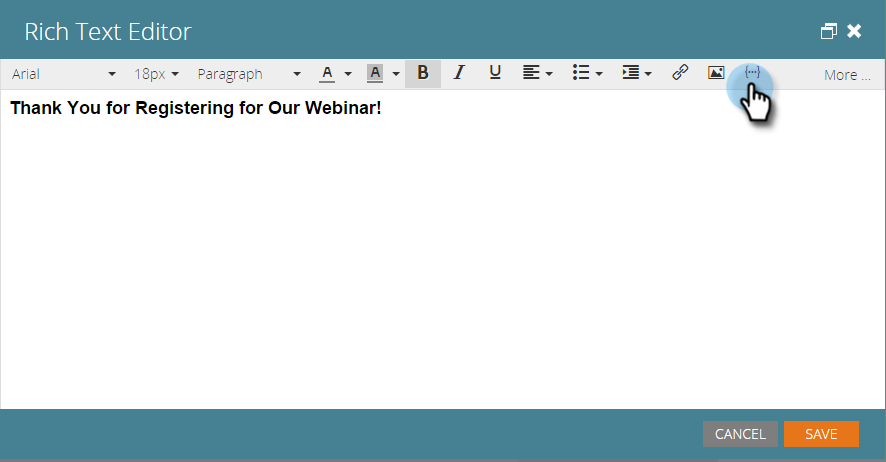
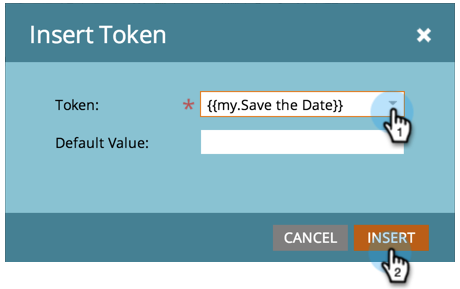

# Include a Calendar Event ICS File in a Landing Page {#include-a-calendar-event-ics-file-in-a-landing-page}

A **Calendar File** token allows you to add a calendar event (.ics) link to your Marketo landing pages.

>[!NOTE]
>
>**Prerequisites**
>
>* [Create a Calendar Event (.ics) File](../../../../product-docs/email-marketing/general/functions-in-the-editor/create-a-calendar-event-ics-file.md)
>

1. In your landing page editor, click **{...}** to insert a token.

   

1. Select the **Calendar File** token and click **Insert**.

   >[!CAUTION]
   >
   >The following tokens are not supported on landing pages:
   >
   >    
   >    
   >    * member.webinar URL
   >    
   >

   

1. Click **Save**.

   People will see a landing page that looks like this:   

Sweet! Everything should be working great now. Make sure to test.

>[!NOTE]
>
>**Related Articles**
>
>* [Include a Calendar Event (.ics) in an Email](../../../../product-docs/email-marketing/general/functions-in-the-editor/include-a-calendar-event-ics-in-an-email.md)
>

