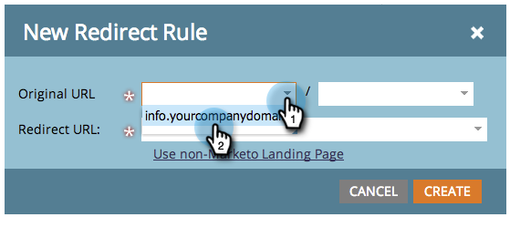
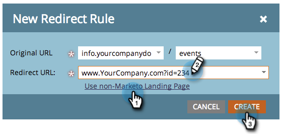

# Redirect a URL Path {#redirect-a-url-path}

Marketo makes it easy to redirect a URL path to any page you choose.

>[!NOTE]
>
>**Admin Permissions Required**

1. Under **[!UICONTROL Admin]**, click **[!UICONTROL Landing Pages]**.

   

1. Click the **[!UICONTROL Rules]** tab, then click **[!UICONTROL New]** and **[!UICONTROL New Redirect Rule]**.

   

1. Click the first **[!UICONTROL Original URL]** drop-down and select your Marketo CNAME.

   

   >[!NOTE]
   >
   >Remember, you can only redirect URLs that start with your Marketo [CNAME](/help/marketo/product-docs/demand-generation/landing-pages/landing-page-actions/customize-your-landing-page-urls-with-a-cname.md).

1. Type the URL path (or specific page) you want to redirect in the second **[!UICONTROL Original URL]** field on the right.

   

1. Click **[!UICONTROL Use non-Marketo Landing Page]**, type the page you want to redirect visitors to in the **[!UICONTROL Redirect URL]** field, and click **[!UICONTROL Create]**.

   

   You can [use Marketo landing pages](/help/marketo/product-docs/demand-generation/landing-pages/landing-page-actions/redirect-a-marketo-landing-page-to-another-page.md) as the destination too.

Your URL path has been successfully redirected.

>[!MORELIKETHIS]
>
>[Redirect a Marketo Landing Page to Another Page](/help/marketo/product-docs/demand-generation/landing-pages/landing-page-actions/redirect-a-marketo-landing-page-to-another-page.md)
