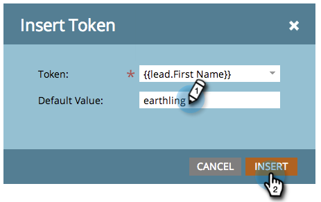
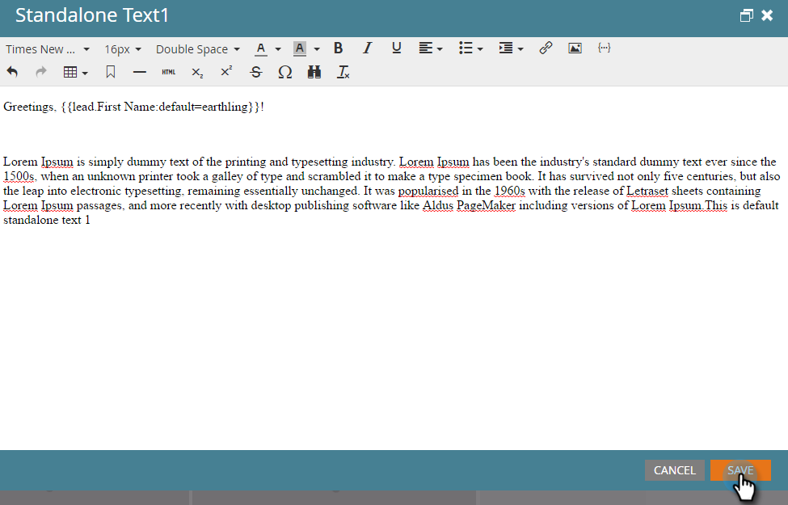

# Tokens Overview {#tokens-overview}

A token is a variable that can be used in Marketo smart campaign flow steps, emails, landing pages, snippets, and web campaigns.

## Understanding Default Values {#understanding-default-values}

When you use a token, you also want to provide a default value. This is the text that shows if a person doesn't have a value for the field you're referencing.

In this example, the email will say "Greetings, (first name)" or "Greetings, earthling" (default value).

>[!CAUTION]
>
>Tokens do not work in the preheader when using Marketo's email editor. To use a token in the preheader, it must be via your own HTML in an email template.

>[!NOTE]
>
>This list is not exhaustive. Tokens are also created for every custom field that you have in Marketo.

## Person Tokens {#person-tokens}

* `{{lead.Acquisition Date}}`
* `{{lead.Acquisition Program Name}}`
* `{{lead.Acquisition Program}}`
* `{{lead.Address}}`
* `{{lead.Anonymous IP}}`
* `{{lead.Black Listed}}`
* `{{lead.City}}`
* `{{lead.Country}}`
* `{{lead.Created At}}`
* `{{lead.Date of Birth}}`
* `{{lead.Department}}`
* `{{lead.Do Not Call}}`
* `{{lead.Do Not Call Reason}}`
* `{{lead.Email Address}}`
* `{{lead.Email Invalid}}`
* `{{lead.Email Invalid Cause}}`
* `{{lead.Fax Number}}`
* `{{lead.First Name}}`
* `{{lead.Full Name}}`
* `{{lead.Id}}` 
* `{{lead.Inferred City}}`
* `{{lead.Inferred Company}}`
* `{{lead.Inferred Country}}`
* `{{lead.Inferred Metropolitan Area}}`
* `{{lead.Inferred Phone Area Code}}`
* `{{lead.Inferred Postal Code}}`
* `{{lead.Inferred State Region}}`
* `{{lead.Is Customer}}`
* `{{lead.Is Employee}}`
* `{{lead.Is Partner}}`
* `{{lead.Job Title}}`
* `{{lead.Last Name}}`
* `{{lead.Lead Source}}`
* `{{lead.Marketing Suspended}}`
* `{{lead.Middle Name}}`
* `{{lead.Mobile Phone Number}}`
* `{{lead.Original Referrer}}`
* `{{lead.Original Search Engine}}`
* `{{lead.Original Search Phrase}}`
* `{{lead.Original Source Info}}`
* `{{lead.Original Source Type}}`
* `{{lead.Person Notes}}`
* `{{lead.Phone Number}}`
* `{{lead.Registration Source Info}}`
* `{{lead.Registration Source Type}}`
* `{{lead.Salutation}}`
* `{{lead.SFDC Created Date}}`
* `{{lead.SFDC Is Deleted}}`
* `{{lead.SFDC Type}}`
* `{{lead.Unsubscribed}}`
* `{{lead.Unsubscribed Reason}}`
* `{{lead.Updated At}}`
* Custom person fields also work if you use their display name, for example, `{{lead.Custom Field Name}}`

## Company Tokens {#company-tokens}

* `{{Company.Account Owner Email Address}}`
* `{{Company.Address}}`
* `{{Company.Annual Revenue}}`
* `{{Company.City}}`
* `{{Company.Company Name}}`
* `{{Company.Company Notes}}`
* `{{Company.Country}}`
* `{{Company.Industry}}`
* `{{Company.Main Phone}}`
* `{{Company.Num Employees}}`
* `{{Company.Parent Company Name}}`
* `{{Company.Postal Code}}`
* `{{Company.SFDC Account Num}}`
* `{{Company.SFDC Created Date}}`
* `{{Company.SFDC Type}}`
* `{{Company.SIC Code}}`
* `{{Company.Site}}`
* `{{Company.State}}`
* `{{Company.Website}}`
* Custom company fields also work if you use their display name ex. `{{Company.Custom Field Name}}`

## Campaign Tokens {#campaign-tokens}

* `{{campaign.name}}`
* `{{campaign.id}}`
* `{{campaign.description}}`

## System Tokens {#system-tokens}

>[!NOTE]
>
>Learn more about these tokens in the [System Tokens Glossary](/help/marketo/product-docs/email-marketing/general/using-tokens/system-tokens-glossary.md).

* `{{system.date}}`
* `{{system.time}}`
* `{{system.dateTime}}`
* `{{system.forwardToFriendLink}}`
* `{{system.unsubscribeLink}}`
* `{{system.viewAsWebpageLink}}`

## Trigger Tokens {#trigger-tokens}

* `{{trigger.Trigger Name}}`
* `{{trigger.Name}}`
* `{{trigger.Link}}` 
* `{{trigger.Subject}}` 
* `{{trigger.Category}}` 
* `{{trigger.Details}}`
* `{{trigger.Web Page}}` 
* `{{trigger.Client IP Address}}`
* `{{trigger.Sent By}}`
* `{{trigger.Received By}}`
* `{{trigger.Referrer}}`
* `{{trigger.Search Engine}}` 
* `{{trigger.Search Query}}`

>[!NOTE]
>
>Find more details about [tokens for interesting moments](/help/marketo/product-docs/marketo-sales-insight/msi-for-salesforce/features/tabs-in-the-msi-panel/interesting-moments/trigger-tokens-for-interesting-moments.md) based on triggers used in a smart campaign.

## Program Tokens {#program-tokens}

* `{{program.Name}}`
* `{{program.Description}}`
* `{{program.id}}`

## My Tokens {#my-tokens}

My Tokens are defined within a program and begin with `{{my.` followed by the name you created for the token. Learn more about [My Tokens in a program](/help/marketo/product-docs/core-marketo-concepts/programs/tokens/understanding-my-tokens-in-a-program.md).

## Member Token {#member-token}

Member Tokens are used to insert unique values from integrated services partners. A common use of Member Tokens is for unique URLs for webinar attendees. Each person has a unique URL to access the webinar that can be inserted using a `{{member.webinar url}}` token. The `{{member.webinar url}}` token automatically resolves the person’s unique confirmation URL generated by the service provider.

* `{{member.webinar url}}`

>[!CAUTION]
>
>The `{{member.webinar url}}` token will only populate if the smart campaign that sends the email is a child asset of the Event Program.
