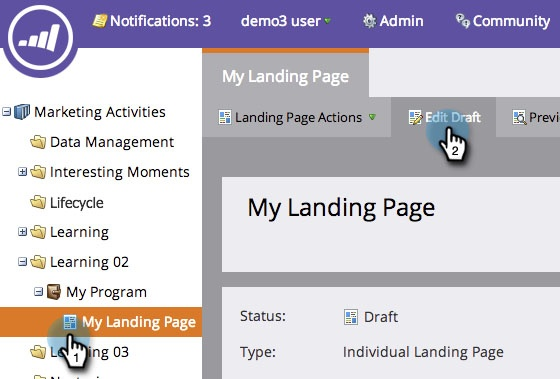
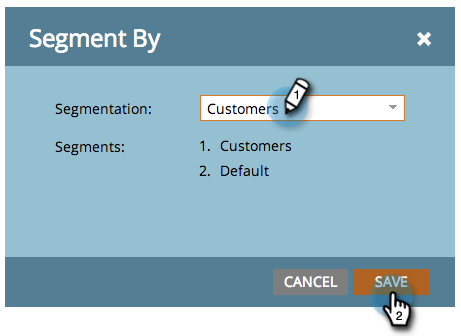
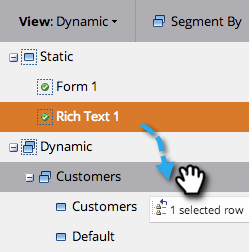
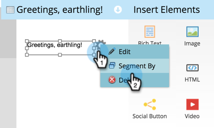
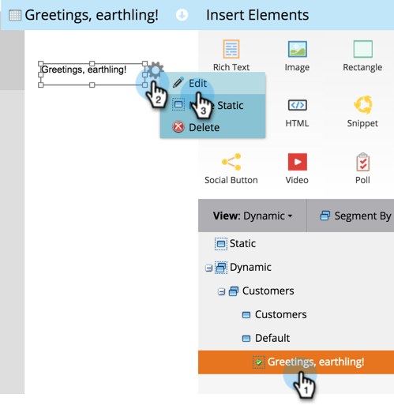

# Use Dynamic Content in a Landing Page {#use-dynamic-content-in-a-landing-page}

>[!NOTE]
>
>**Prerequisites**
>
>* [Create a Segmentation](../../../../product-docs/personalization/segmentation-and-snippets/segmentation/create-a-segmentation.md)
>* [Create a Free-Form Landing Page](../../../../product-docs/demand-generation/landing-pages/free-form-landing-pages/create-a-free-form-landing-page.md)
>* [Add a New Form to a Free-Form Landing Page](../../../../product-docs/demand-generation/landing-pages/free-form-landing-pages/add-a-new-form-to-a-free-form-landing-page.md)
>

Using dynamic content in landing pages engages people with targeted information. 

### What's in this article? {#whats-in-this-article}

[Add Segmentation](#add-segmentation)  
[Make Element Dynamic](#make-element-dynamic)  
[Apply Dynamic Content](#apply-dynamic-content)

#### Add Segmentation {#add-segmentation}

1. Go to **Marketing Activities**.

   

   ##### Click your Landing Page and then click Edit Draft. {#click-your-landing-page-and-then-click-edit-draft}

   

   ##### Click Segment By. {#click-segment-by}

   

   ##### Enter the&nbsp;Segmentation name and click&nbsp;Save. {#enter-the-segmentation-name-and-click-save}

   

   ##### Your segmentation and its segments appear under Dynamic on the right. {#your-segmentation-and-its-segments-appear-under-dynamic-on-the-right}

   

   >[!NOTE]
   >
   >All landing page elements are Static by default.

#### Make Element Dynamic {#make-element-dynamic}

1. Drag and drop elements from Static to **Dynamic**.

   

1. You can also make elements Static or Dynamic from the element **Settings**.

   

#### Apply Dynamic Content {#apply-dynamic-content}

1. Select an element under a segment and then click **Edit**. Repeat for each segment.

   

1. A green check mark indicates content specific to segment. A blank indicates default segment content.

   

   >[!CAUTION]
   >
   >Changes to the default segment content block are applied to all segments.

   >[!TIP]
   >
   >Create a default landing page before modifying content for the various segments.

Voila! You can now send targeted content.

>[!NOTE]
>
>**Related Articles**
>
>* [Preview a Landing Page with Dynamic Content](../../../../product-docs/demand-generation/landing-pages/landing-page-actions/preview-a-landing-page-with-dynamic-content.md)
>* [Using Dynamic Content in an Email](../../../../product-docs/email-marketing/general/functions-in-the-editor/using-dynamic-content-in-an-email.md)
>

