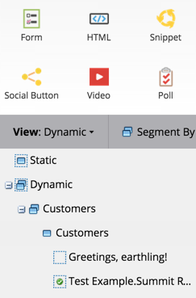

# Use Dynamic Content in a Landing Page {#use-dynamic-content-in-a-landing-page}

>[!PREREQUISITES]
>
>* [Create a Segmentation](/help/marketo/product-docs/personalization/segmentation-and-snippets/segmentation/create-a-segmentation.md)
>* [Create a Free-Form Landing Page](/help/marketo/product-docs/demand-generation/landing-pages/free-form-landing-pages/create-a-free-form-landing-page.md)
>* [Add a New Form to a Free-Form Landing Page](/help/marketo/product-docs/demand-generation/landing-pages/free-form-landing-pages/add-a-new-form-to-a-free-form-landing-page.md)

Using dynamic content in landing pages engages people with targeted information.

## Add Segmentation {#add-segmentation}

1. Go to **[!UICONTROL Marketing Activities]**.

   

   Click your **[!UICONTROL Landing Page]** and then click **[!UICONTROL Edit Draft]**.

   

   Click **[!UICONTROL Segment By]**.

   

   Enter the **[!UICONTROL Segmentation]** name and click **[!UICONTROL Save]**.

   

   Your segmentation and its segments appear under **[!UICONTROL Dynamic]** on the right.

   

   >[!NOTE]
   >
   >All landing page elements are **[!UICONTROL Static]** by default.

## Make Element Dynamic {#make-element-dynamic}

1. Drag and drop elements from **[!UICONTROL Static]** to **[!UICONTROL Dynamic]**.

   

1. You can also make elements [!UICONTROL Static] or [!UICONTROL Dynamic] from the element **[!UICONTROL Settings]**.

   

## Apply Dynamic Content {#apply-dynamic-content}

1. Select an element under a segment and then click **[!UICONTROL Edit]**. Repeat for each segment.

   

1. A green check mark indicates content specific to a segment. A blank indicates default segment content.

   

   >[!CAUTION]
   >
   >Changes to the default segment content block are applied to all segments.

   >[!TIP]
   >
   >Create a default landing page before modifying content for the various segments.

You can now send targeted content to your segments.

>[!MORELIKETHIS]
>
>* [Preview a Landing Page with Dynamic Content](/help/marketo/product-docs/demand-generation/landing-pages/landing-page-actions/preview-a-landing-page-with-dynamic-content.md)
>* [Using Dynamic Content in an Email](/help/marketo/product-docs/email-marketing/general/functions-in-the-editor/using-dynamic-content-in-an-email.md)
