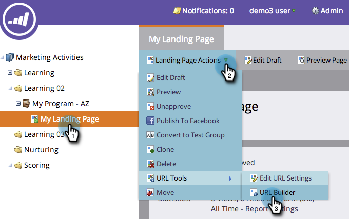
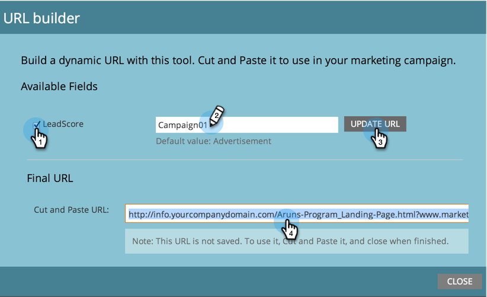

# Using the URL Builder {#using-the-url-builder}

Using the URL Builder - Marketo Docs - Product Documentation

The URL Builder helps you construct URLs that can populate Marketo hidden form fields.

>[!NOTE]
>
>**FYI**
>
>Marketo is now standardizing language across all subscriptions, so you may see lead/leads in your subscription and person/people in docs.marketo.com. These terms mean the same thing; it does not affect article instructions. There are some other changes, too. [Learn more](http://docs.marketo.com/display/DOCS/Updates+to+Marketo+Terminology).

>[!NOTE]
>
>**Prerequisites**
>
>Learn how to create hidden fields in forms and edit their settings in [Set a Form Field as Hidden](../../../../product-docs/demand-generation/forms/form-fields/set-a-form-field-as-hidden.md).

1. Select a landing page, click on **Landing Page Actions**, hover over **URL Tools**, then click on **URL Builder**.

   

1. Select the field(s) you want to use, enter the value, and click **Update URL**.

   

   >[!NOTE]
   >
   >If you do not see any fields available in the builder, ensure that your form has hidden fields and that they are [set to accept URL Parameters](http://docs.marketo.com/display/DOCS/Set+a+Hidden+Form+Field+Value#SetaHiddenFormFieldValue-URLParameter).

Great work! You can now copy and paste the URL and use it on the web.
