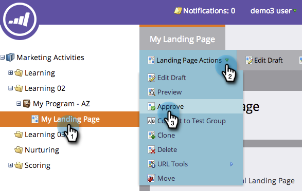
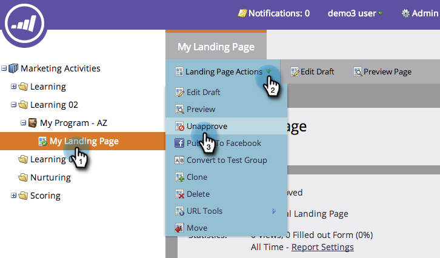
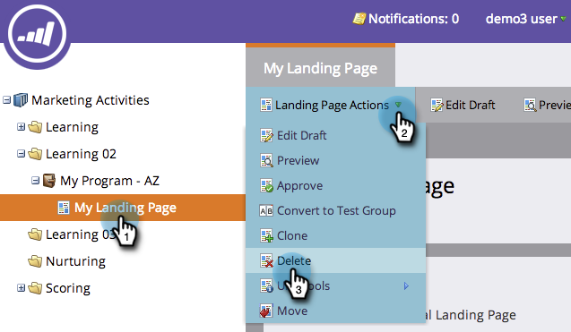
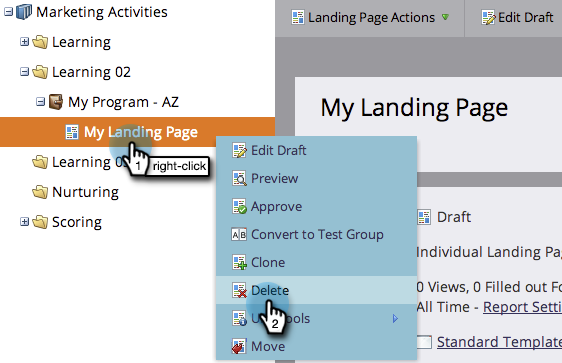
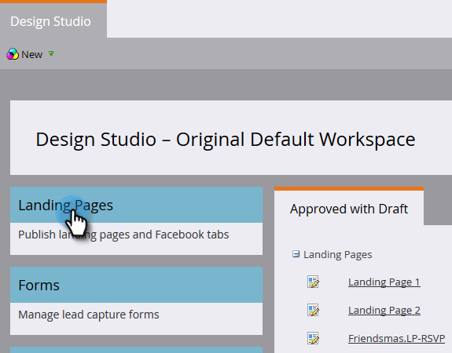
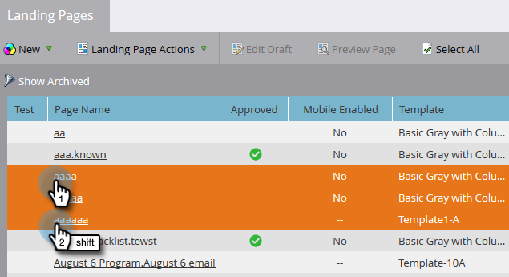
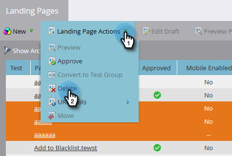
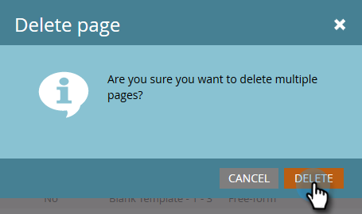

# Approve, Unapprove, or Delete a Landing Page {#approve-unapprove-or-delete-a-landing-page}

Landing pages are in draft mode until you approve them. Approval makes pages available in the rest of the system. When you edit an approved landing page, Marketo saves the draft, but continues to use the approved version until you approve the draft.

## Approve a Landing Page {#approve-a-landing-page}

1. Select a landing page, go to **[!UICONTROL Landing Page Actions]** and click **[!UICONTROL Approve]**.

   >[!TIP]
   >
   >You can [approve multiple pages at once](/help/marketo/product-docs/demand-generation/landing-pages/landing-page-actions/approve-multiple-landing-pages-at-once.md) to make your life easier.

   

1. You can also right click your landing page and click **[!UICONTROL Approve]**.

   

   >[!NOTE]
   >
   >Once approved, your landing page icon will have a green checkmark on it.

## Unapprove a Landing Page {#unapprove-a-landing-page}

1. Select a landing page, go to **[!UICONTROL Landing Page Actions]** and click **[!UICONTROL Unapprove]**.

   

1. You can also right-click your landing page and click **[!UICONTROL Unapprove]**.

   

>[!NOTE]
>
>Your unapproved landing page is no longer published on the web and will generate no additional activity. Visitors to unapproved landing pages and their Facebook Tabs will see the [Fallback Page](/help/marketo/product-docs/administration/settings/set-a-fallback-page.md).

## Delete a Landing Page {#delete-a-landing-page}

1. Select a landing page, go to **[!UICONTROL Landing Page Actions]** and click **[!UICONTROL Delete]**.

   

   >[!NOTE]
   >
   >You cannot delete an approved landing page. Unapprove it first.

1. You can also right click your landing page and click **[!UICONTROL Delete]**.

   

## Delete Multiple Landing Pages {#delete-multiple-landing-pages}

Want to delete more than one landing page at a time? Here's how.

1. In [!UICONTROL Design Studio], click **[!UICONTROL Landing Pages]**.

   

1. Click on the first landing page you want deleted, then shift+click the last one.

   

   >[!TIP]
   >
   >You can also utilize ctrl+click to delete multiple landing pages that are not sequential.

1. Click the **[!UICONTROL Landing Page Actions]** drop-down and select **[!UICONTROL Delete]**.

   

1. Click **[!UICONTROL Delete]**.

   

Awesome! Now you know how to approve, unapprove and delete landing pages.
