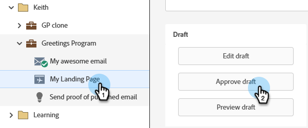
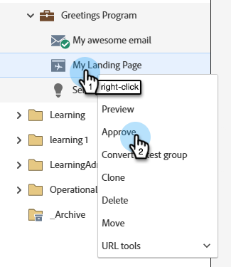
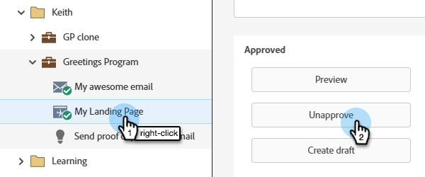
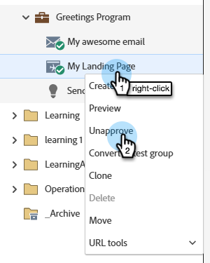
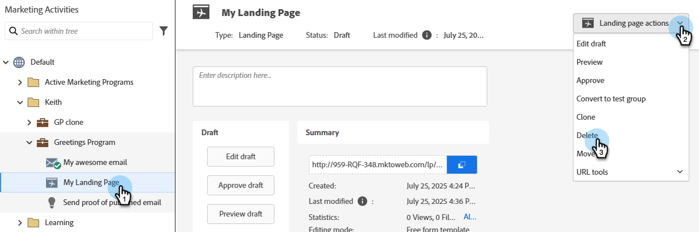
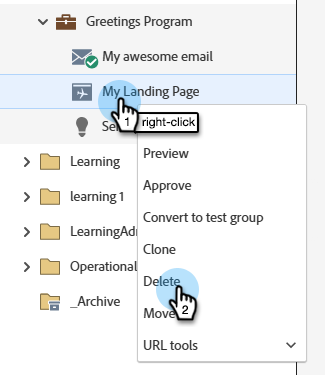
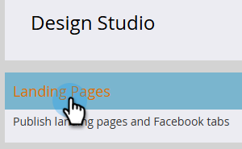
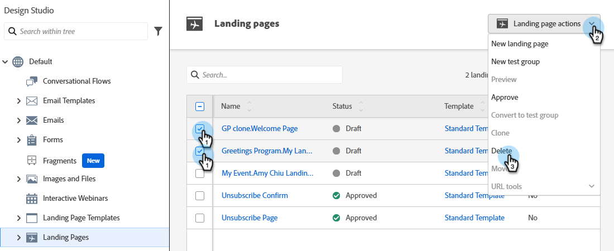
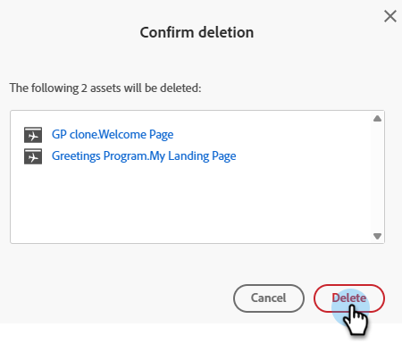

# Approve, Unapprove, or Delete a Landing Page {#approve-unapprove-or-delete-a-landing-page}

Landing Pages are in draft mode until you approve them. Approval makes pages available in the rest of the system. When you edit an approved Landing Page, Marketo Engage saves the draft, but continues to use the approved version until you approve the draft.

## Approve a Landing Page {#approve-a-landing-page}

1. Select the desired Landing Page and click and click **[!UICONTROL Approve draft]**.

   

   >[!TIP]
   >
   >You have the ability to [approve multiple pages at once](/help/marketo/product-docs/demand-generation/landing-pages/landing-page-actions/approve-multiple-landing-pages-at-once.md) if desired.

You can also right-click your Landing Page in the left nav and select **[!UICONTROL Approve]**.

   

   >[!NOTE]
   >
   >An approved Landing Page has a green checkmark added to it.

## Unapprove a Landing Page {#unapprove-a-landing-page}

1. Select the desired Landing Page and click **[!UICONTROL Unapprove]**.

   

You can also right-click your Landing Page in the left nav and select **[!UICONTROL Unapprove]**.

   

>[!NOTE]
>
>Your unapproved Landing Page is no longer published on the web and will generate no additional activity. Visitors to unapproved Landing Pages and their Facebook Tabs will see the [Fallback Page](/help/marketo/product-docs/administration/settings/set-a-fallback-page.md).

## Delete a Landing Page {#delete-a-landing-page}

1. Select the desired Landing Page. Click the **[!UICONTROL Landing Page Actions]** drop-down and select **[!UICONTROL Delete]**.

   

   >[!IMPORTANT]
   >
   >You cannot delete an approved Landing Page. You must unapprove it first.

You can also right-click your Landing Page in the left nav and select **[!UICONTROL Delete]**.

   

## Delete Multiple Landing Pages {#delete-multiple-landing-pages}

1. On the main [!UICONTROL Design Studio] screen, click **[!UICONTROL Landing Pages]**.

   

1. Select the desired Landing Pages. Click the **[!UICONTROL Landing Page Actions]** drop-down and select **[!UICONTROL Delete]**.

   

1. Click **[!UICONTROL Delete]** to confirm.

   
