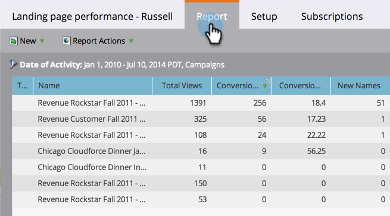

# Landing Page Performance Report {#landing-page-performance-report}

See how many people filled out the `forms` in your `landing pages`, and how many of them were new.

1. [Create a report](../../../../product-docs/reporting/basic-reporting/creating-reports/create-a-report-in-a-program.md) and select the Landing Page Performance [report type](../../../../product-docs/reporting/basic-reporting/report-types/report-type-overview.md).
1. [Set the time frame of your report](../../../../product-docs/reporting/basic-reporting/editing-reports/change-a-report-time-frame.md) and click the Report tab.
1. That's it! Explore your report to assess how well your landing pages are doing.

   

   Among the columns in a landing page performance report, Conversions and Conversion % reflect the number of times someone filled out a form.

   >[!TIP]
   >
   >Find the pages with the highest Conversion percentage! [Sort your report](../../../../product-docs/reporting/basic-reporting/editing-reports/sort-report-on-columns.md) on that column and choose Sort Descending.

   The AB icon in the report indicates the stats are the total for all pages in that [landing page test group](landing-page-test-groups.md).

1. Scroll to the right to see the number of visits that originated from various social media platforms.

   

>[!NOTE]
>
>Activity generated by the [social button with analytics](../../../../product-docs/demand-generation/landing-pages/free-form-landing-pages/add-a-social-button-to-a-free-form-landing-page.md) is not included here. For those stats, see the [Social Dashboard](../../../../product-docs/demand-generation/social/social-functions/view-social-performance.md).

>[!NOTE]
>
>**Deep Dive**
>
>Learn about other interesting reports in the  [Basic Reporting](http://docs.marketo.com/display/docs/basic+reporting) deep dive. 

>[!NOTE]
>
>**Related Articles**
>
>* [Filter your landing page performance report](../../../../product-docs/demand-generation/landing-pages/landing-page-actions/filter-a-landing-page-performance-report.md) by local or global assets.
>

