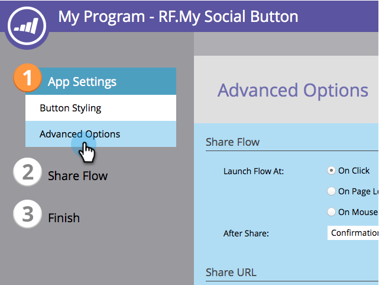
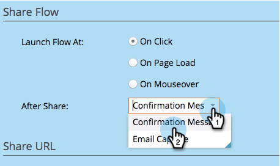
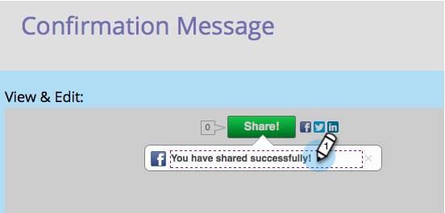
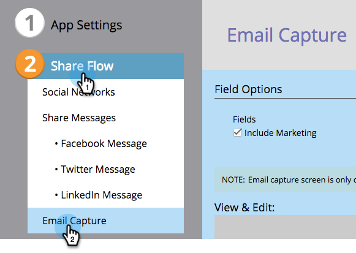

# Configure After-Share Prompts {#configure-after-share-prompts}

In social button, video share, and poll apps, you can choose what happens after a person shares your content on their social network.

1. Go to **[!UICONTROL Marketing Activities]**.

   

1. Select the app, and click **[!UICONTROL Edit Draft]**.

   

1. In the social app editor, go to **[!UICONTROL App Settings]** and then **[!UICONTROL Advanced Options]**.

   

1. For **[!UICONTROL After Share]**, select the behavior you want.

   

    * **[!UICONTROL Confirmation Message]**: Once the person has shared, display a confirmation.
    * **[!UICONTROL Email Capture]**: Once the person has shared, request their email address.

   >[!NOTE]
   >
   >If you choose **[!UICONTROL Email Capture]**, the request is only displayed if the person has not already provided their information.

1. If you chose **[!UICONTROL Confirmation Message]**: Go to **[!UICONTROL Share Flow]** and then **[!UICONTROL Confirmation Message]**.

   

1. Edit the confirmation message.

   

1. If you chose **[!UICONTROL Email Capture]** (instead of confirmation): Go to **[!UICONTROL Share Flow]** and then **[!UICONTROL Email Capture]**.

   

1. Choose whether to include a marketing prompt, and whether that checkbox is selected by default (**[!UICONTROL Opt Out]**) or not (**[!UICONTROL Opt In]**).

   

1. Edit the request for email address and the marketing prompt (if you included it).

   
