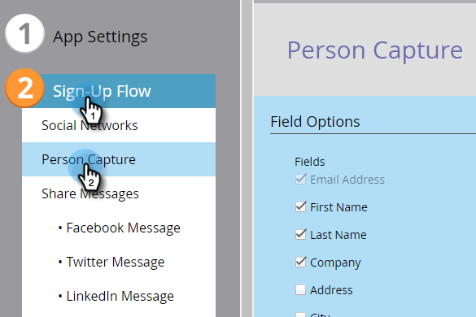
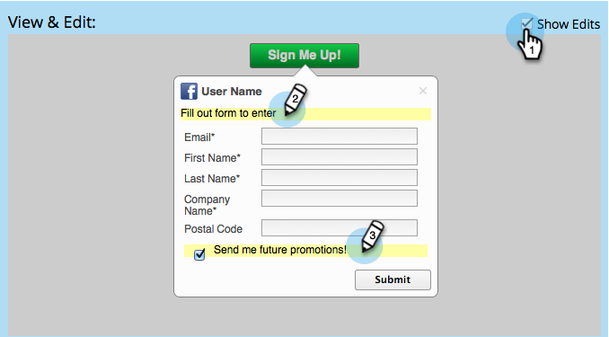

# Configure Person Capture for a Social App {#configure-person-capture-for-a-social-app}

When you create a [referral offer](/help/marketo/product-docs/demand-generation/social/referral-offers/create-a-referral-offer.md) or a [sweepstakes](/help/marketo/product-docs/demand-generation/social/sweepstakes/create-sweepstakes.md), you can configure what information you request and what information you require from people in order to participate.

>[!NOTE]
>
>People are only prompted for this information if they have not provided it previously.

1. Go to **[!UICONTROL Marketing Activities]**.

   

1. Select the app, and click **[!UICONTROL Edit Draft]**.

   

1. In the social app editor, go to **[!UICONTROL Sign-Up Flow]** > **[!UICONTROL Person Capture]**.

   

1. Select the information you will request, and indicate the fields that are specifically required to sign up for your offer.

   

   Include Marketing options:

    * **[!UICONTROL Opt Out]**: Person is subscribed by default.
    * **[!UICONTROL Opt In]**: Person can choose to subscribe.

   >[!NOTE]
   >
   >Either way, participants will still receive the [_operational_ emails](/help/marketo/product-docs/email-marketing/general/functions-in-the-editor/make-an-email-operational.md) from your offer.

1. In the [!UICONTROL View & Edit] window, click **[!UICONTROL Show Edits]** and edit the messages in the share prompt.

   

>[!MORELIKETHIS]
>
>Now you can [configure the social sign-up flow](/help/marketo/product-docs/demand-generation/social/configuring-social-actions/configure-social-sign-up-share-flow.md) and edit the share messages that will be posted to each social network.
