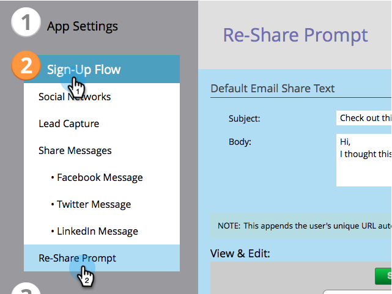
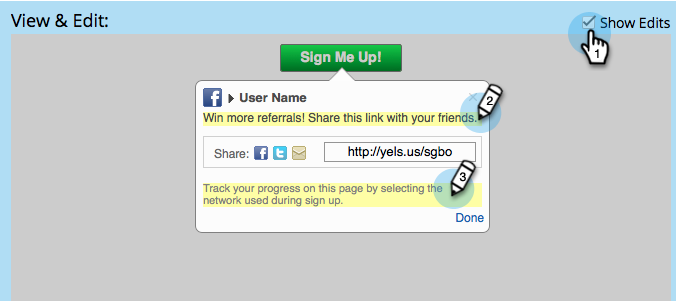

# Configure Re-Share Email and Prompt for a Social App {#configure-re-share-email-and-prompt-for-a-social-app}

When you create a [referral offer](/help/marketo/product-docs/demand-generation/social/referral-offers/create-a-referral-offer.md) or a [sweepstakes](/help/marketo/product-docs/demand-generation/social/sweepstakes/create-sweepstakes.md), you can invite participants to share your offer with more friends as part of the sign-up process, as well as provide default text for the share email.

>[!NOTE]
>
>In a referral offer, you can also [make sharing the offer a requirement](/help/marketo/product-docs/demand-generation/social/social-functions/set-social-share-requirement.md) to sign up.

1. Go to **Marketing Activities**.

   

1. Select the referral offer, and click **Edit Draft**.

   

1. In the referral offer editor, go to **Sign-Up Flow** > **Re-Share Prompt**.

   

1. Edit the email that will go to your participant's friends if they choose to share.

   >[!NOTE]
   >
   >The email automatically includes your participant's unique share URL.

1. In the **View & Edit** window, click **Show Edits** and edit the invitation to share as well as the track-progress instructions.

   

>[!MORELIKETHIS]
>
>Next, you can configure the [track progress flow in a referral offer](configure-track-progress-flow-for-a-referral-offer.md), or click **Finish** > **Approve and Close** to [publish your referral offer](/help/marketo/product-docs/demand-generation/social/referral-offers/publish-a-referral-offer.md) or [sweepstakes](/help/marketo/product-docs/demand-generation/social/sweepstakes/create-sweepstakes.md).
