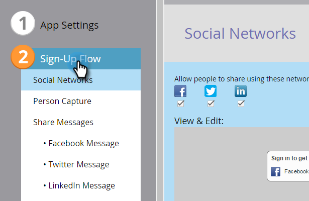
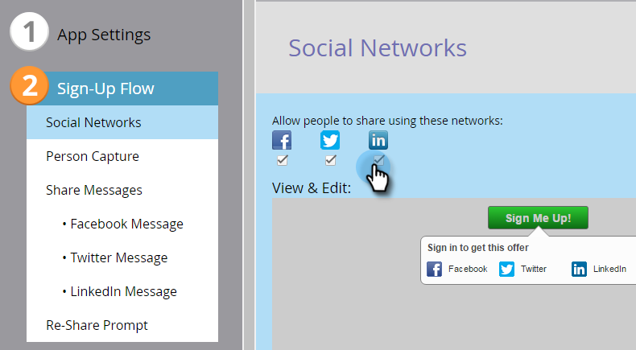
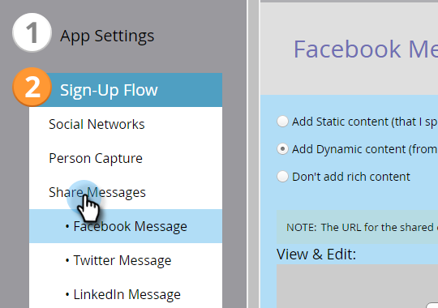
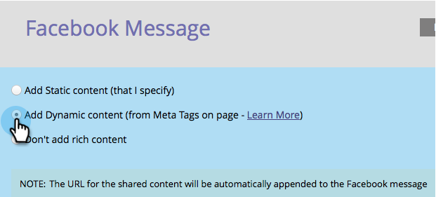
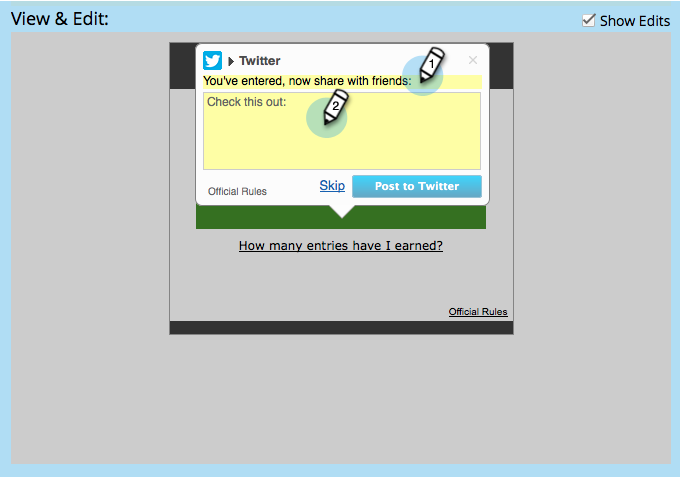
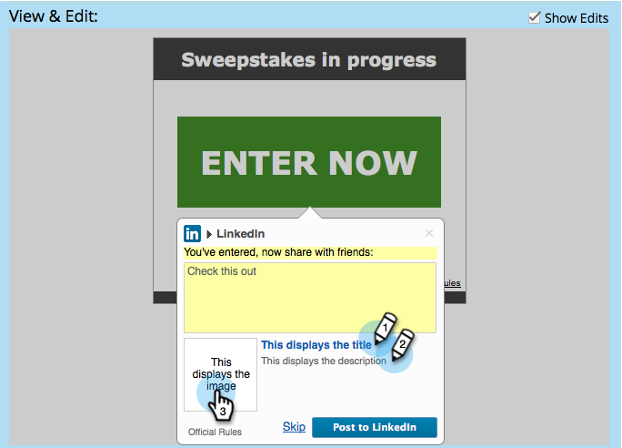

# Configure Social Sign-Up/Share Flow {#configure-social-sign-up-share-flow}

When you create a social app, you can configure the social network choices and prompts that a user encounters as they sign up.

## Select Networks for Sharing {#select-networks-for-sharing}

1. Go to **[!UICONTROL Marketing Activities]**.

   

1. Select the app, and click **[!UICONTROL Edit Draft]**.

   

1. In the social app editor, click **[!UICONTROL Sign-Up Flow]** > **[!UICONTROL Social Networks]**.

   

1. Select (or de-select) the networks a person can share to.

   

## Configure the [!UICONTROL Facebook Message] {#configure-the-facebook-message}

1. Go to **[!UICONTROL Sign-Up Flow]** > **[!UICONTROL Share Messages]**.

   

1. Configure the message that will appear in Facebook posts.

   

   >[!NOTE]
   >
   >In a video share, the thumbnail is generated automatically.

   If you choose **[!UICONTROL Add Dynamic content]**, the values of the page’s **[!UICONTROL OpenGraph]** tags (og:title, og:caption, and og:description) and the thumbnail are automatically added to Facebook posts. See the next step.

   If you choose **[!UICONTROL Add Static content]**, enter the title, caption, description, and upload an image. See the next two steps.

1. In the **[!UICONTROL View & Edit]** window, click **[!UICONTROL Show Edits]** and edit the share prompt and message that will appear in Facebook posts.

   >[!TIP]
   >
   >For more information, see [Edit Facebook Rich Post Settings](/help/marketo/product-docs/demand-generation/facebook/edit-facebook-rich-post-settings.md).

   

   >[!NOTE]
   >
   >The [share URL](/help/marketo/product-docs/demand-generation/social/social-functions/choose-the-share-url-for-a-social-app.md) is automatically added to all share messages.

1. If you chose **[!UICONTROL Add Static content]** above, edit the title, caption, and description, and upload a custom image (from your [**Marketo Images and Files**](/help/marketo/product-docs/demand-generation/images-and-files/add-images-and-files-to-marketo.md)).

   

   See [Add Images and Files to Marketo](/help/marketo/product-docs/demand-generation/images-and-files/add-images-and-files-to-marketo.md).

   >[!NOTE]
   >
   >If you upload an image, you will not see it here until you close and reopen the social app editor.

1. Click **[!UICONTROL Next]**.

If you choose the values of the page’s tags (og:title, og:caption, and og:description) and the thumbnail are automatically added to Facebook posts. See the next step.

## Configure the [!UICONTROL Twitter Message] {#configure-the-twitter-message}

1. Edit the share prompt and message that will appear in Twitter tweets.

   

   >[!TIP]
   >
   >Use {html_title} in your tweet text to display the title of the page automatically.

1. Click **[!UICONTROL Next]**.

## Configure the [!UICONTROL LinkedIn Message] {#configure-the-linkedin-message}

1. Configure the message that will appear in LinkedIn posts.

   

   If you choose **[!UICONTROL Add Dynamic content]**, the values of the pages tags (title and description), and the thumbnail, are automatically added to LinkedIn posts. See the next step.

   If you choose **[!UICONTROL Add Static content]**, enter the title, caption, and description, and upload an image. See the next two steps.

1. In the **[!UICONTROL View & Edit]** window, click **[!UICONTROL Show Edits]** and edit the share prompt and message that will appear in LinkedIn posts.

   

   >[!TIP]
   >
   >Use {html_title} in your post text to display the title of the page automatically.

1. If you chose **[!UICONTROL Add Static content]** above, edit the title and description, and upload a custom image (from your [**Marketo Images and Files**](/help/marketo/product-docs/demand-generation/images-and-files/add-images-and-files-to-marketo.md)).

   

>[!NOTE]
>
>If you upload an image, you will not see it here until you close and reopen the social app editor.

>[!MORELIKETHIS]
>
>Next, you can click **[!UICONTROL Finish]** > **[!UICONTROL Approve and Close]** and put your social app on a landing page. You can also configure [person capture](/help/marketo/product-docs/demand-generation/social/configuring-social-actions/configure-person-capture-for-a-social-app.md) or the [re-share prompt](/help/marketo/product-docs/demand-generation/social/configuring-social-actions/configure-re-share-email-and-prompt-for-a-social-app.md).
