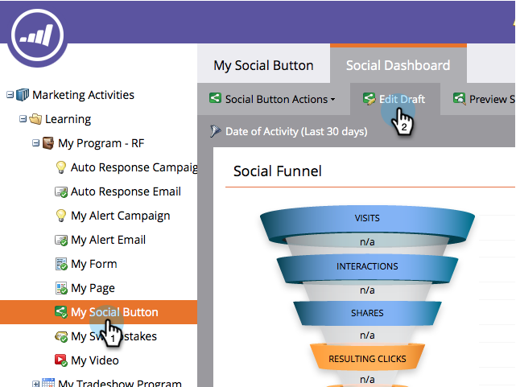
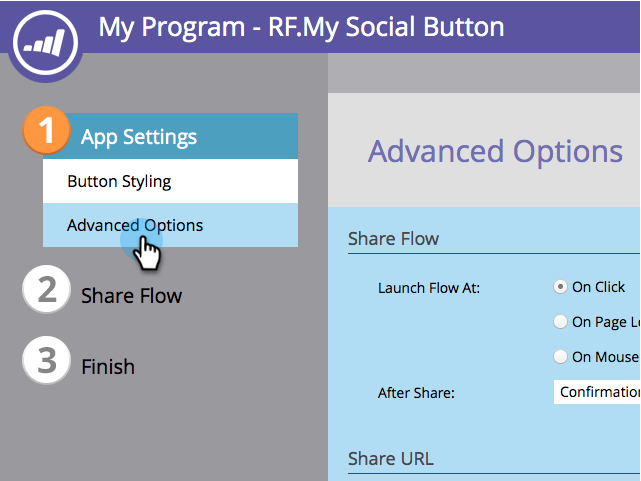

# Configure When Social Button Opens {#configure-when-social-button-opens}

When you create a [social button](/help/marketo/product-docs/demand-generation/landing-pages/free-form-landing-pages/add-a-social-button-to-a-free-form-landing-page.md), you can configure when the button presents the share prompt.

1. Go to **Marketing Activities**.

   

1. Select the app, and click **Edit Draft**.

   

1. In the social app editor, go to **App Settings** > **Advanced Options**.

   

1. Choose when the share button presents the share prompts.

   

    * **On Click:** When a person clicks the social button.
    * **On Page Load:** As soon as the landing page that contains the social button loads in a person's browser.
    * **On Mouseover:** When a person hovers over the social button.

   >[!MORELIKETHIS]
   >
   >After the person has shared, you can request their email address or present a confirmation message. Learn how to [configure the after-share prompts](/help/marketo/product-docs/demand-generation/social/configuring-social-actions/configure-after-share-prompts.md).
