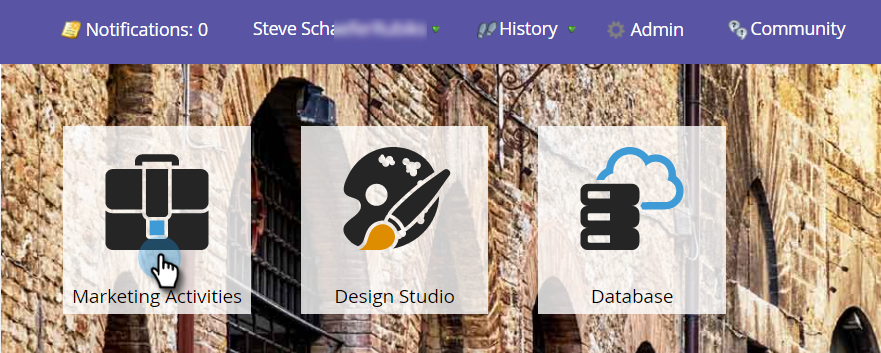
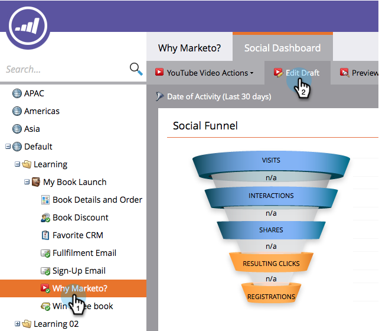
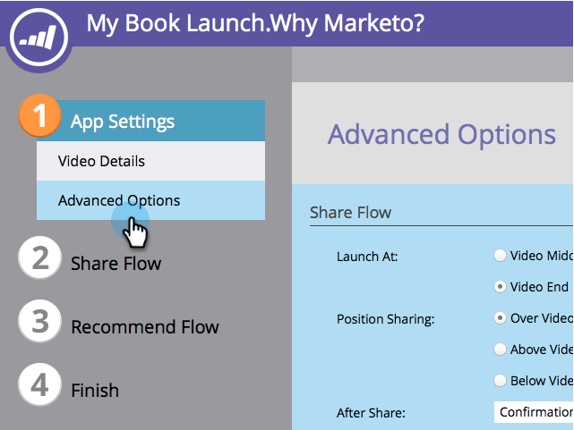
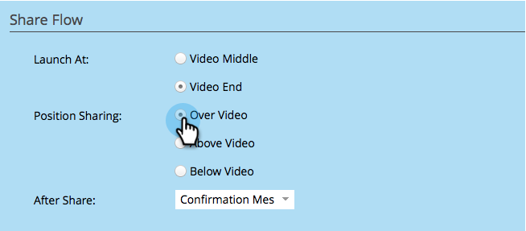

# Customize Video Share Flow {#customize-video-share-flow}

When you [create a video share](/help/marketo/product-docs/demand-generation/landing-pages/free-form-landing-pages/add-a-video-to-a-free-form-landing-page.md), you can customize when and where the share prompt appears.

1. Go to **Marketing Activities**.

   

1. Select the app, and click **Edit Draft**.

   

1. In the video share editor, go to **App Settings** > **Advanced Options**.

   

1. Choose when the app prompts the user to share, and where that prompt appears.

   

>[!MORELIKETHIS]
>
>The next step is to [configure what happens after video share](/help/marketo/product-docs/demand-generation/social/configuring-social-actions/configure-after-share-prompts.md).
