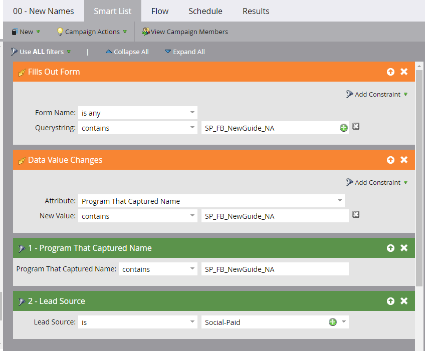
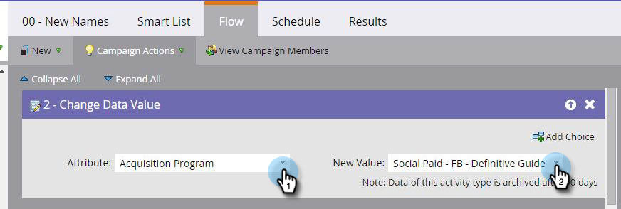
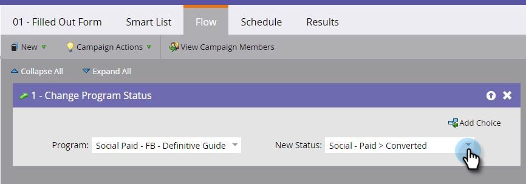

# Set up Revenue Attribution for Digital Advertising Campaigns {#set-up-revenue-attribution-for-digital-advertising-campaigns}

Here's how to set up revenue attribution for digital advertising channels and campaigns. After you've set it up, you can do first-touch and multi-touch revenue attribution for digital ads the same as in other Marketo programs.

After you set up your first ad program in Marketo, you can clone and update it for other channels. For example, clone a LinkedIn program to a Facebook one.

With separate programs, you then can track the number of conversions from each one and see your programs in Program Analyzer, Opportunity Influence Analyzer, and other Marketo Analytics features.

>[!PREREQUISITES]
>
>* Set up a channel tag with status values and program success (for example, Digital Advertising or Social Paid and PPC)
>* Create or edit a form to pass a query string through with the person
>* Be sure you have access to some Revenue Cycle Analytics capabilities to report on your ad channels and campaigns

## Create a Default Program {#create-a-default-program}

Unlike some programs (such as email) which may run periodically for a specific period of time, default programs are always on.

1. Go to **Marketing Activities**.

   

1. Click **New** and select **New Program**.

   

1. If you already have a program in place, you can [clone it](/help/marketo/product-docs/core-marketo-concepts/programs/working-with-programs/clone-a-program.md).

   >[!TIP]
   >
   >Whenever you clone a program, be sure to replace the names in the query string fields of the smart lists.

1. Place the new program in a specific campaign folder, after the initial program is set.

   >[!NOTE]
   >
   >**Example**
   >
   >A query string passed through the URL helps Marketo know which ad campaign someone clicked on when they became a person in Marketo.
   >
   >You can create a query string methodology that includes all the variables you want to measure. Marketo uses these variables to add people to your different programs.
   >
   >For example, you could use Channel type_Channel__Asset__Region. That might look like: SP_FB_NewGuide_US. **Note**: abbreviations save space.
   >
   >Or, set it up as Channel_Adsource_AssetName_Region_UniqueIdNumber. That could look like: Social-Paid_Facebook_NewGuide_NA_123.

## Create a Smart Campaign for New Names {#create-a-smart-campaign-for-new-names}

1. In the smart campaign, create a smart list that contains two triggers and two filters, as shown.

   

   >[!NOTE]
   >
   >The query string used in the two triggers and the **Program That Captured Name** filter is unique to you. The query strings shown here are for example only. If you cloned the field, simply replace these fields.

1. Create a flow step to change the attribute to **Acquisition Program** and set the New Value to the value you've defined for paid social campaigns.

   

1. Schedule and activate the campaign.

## Create a Smart Campaign for Status/Program Success {#create-a-smart-campaign-for-status-program-success}

You need a second smart campaign to change the status of people, so they can achieve Program Success and be included in revenue attribution calculations.

1. In the **Fills Out Form** trigger, enter the program name in the query string. If you're cloning the program, just replace the old query string name with the new one.

   

1. Create flow steps to change the status to one associated with program success.

   

   >[!NOTE]
   >
   >The example above shows **Converted**, but this depends on your status/success values.

1. Schedule and activate the campaign.

## Create Your Ad {#create-your-ad}

After you've set up the program and campaigns, create the new ad.

1. Go to the channel; e.g., LinkedIn or Facebook.
1. Create a new ad.
1. Select a Marketo landing page as a destination for the Call To Action in the campaign.
1. Add the query string to the URL.

   >[!NOTE]
   >
   >**Example**
   >
   >Here's how you can add all the information you set up into an actual URL. The items are separated by an ampersand (&):
   >
   >`www.marketo.com?**source**=Social-Paid&**comment**=Social-Paid_Facebook_NewGuide_NA&**camp**=abc&**kk=**xyz`
   >
   >* **source** is the Person Source used as a channel identifier
   >* **comment** is the unique identifier created for each program
   >* **camp** is the campaign in Facebook, LinkedIn, or Google
   >* **kk** is the keyword or asset name you want to capture
   >
   >**These four terms must be all lowercase and there can't be any spaces in the URL for this information to be captured.**

## Best Practices {#best-practices}

Use a single channel tag to represent all of Digital Advertising, or use multiple channel tags if you want more granular comparisons against your other marketing channels (for example, Social-Paid, Search-Paid, Display, Retargeting).

Then, set up different programs for each reporting view you need. Use a common ID as a parameter in the URL (BC, for example) in the query string if you have 10 regions launching a "Big Campaign" together and want to be able to view results across regions.

If you want to report on each region and the collective results of the Big Campaign, create 11 programs--one for each region and one for the Big Campaign. Each program references only the relevant characters from the query string (such as BC).

There is intentional overlap in person count between the Big Campaign and the region programs, so you wouldn't want to report on the total count of people across all 11 programs, as some people are in both the Big Campaign and one of the region programs.
