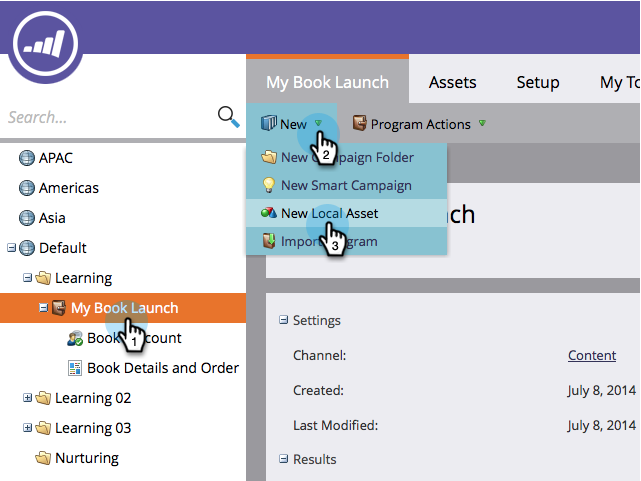
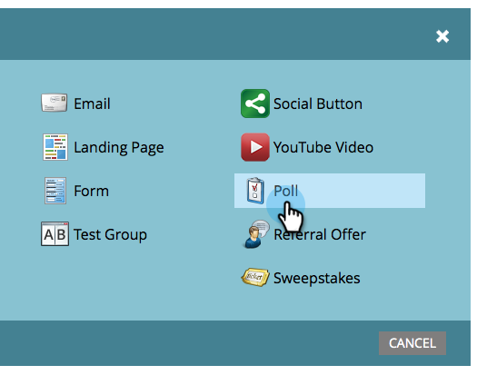
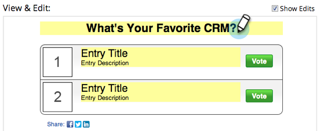
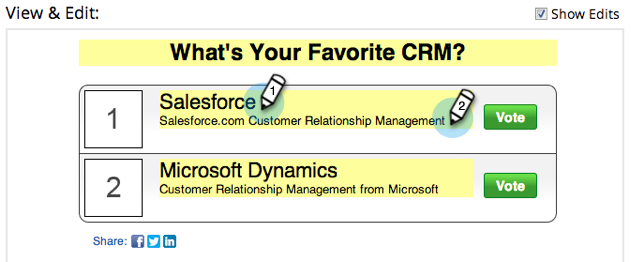
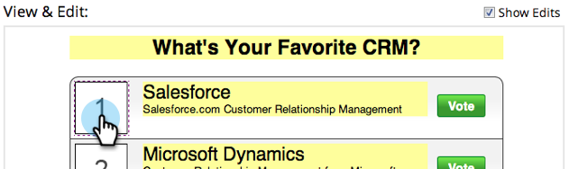
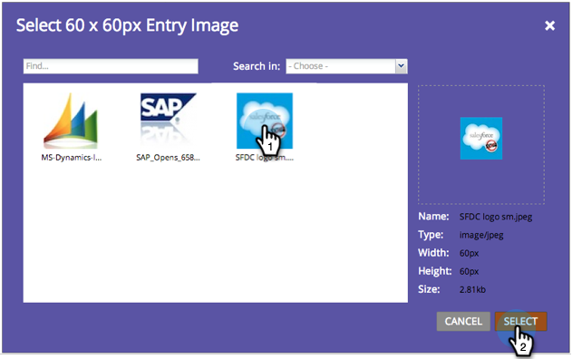
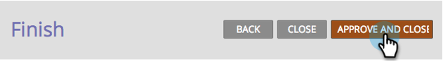

# Create a Poll {#create-a-poll}

Engage people with a poll they can vote in and share with their friends on social networks. You can add it to places like your landing pages, your website, and Facebook.  

>[!AVAILABILITY]
>
>Not all customers have purchased this functionality. Contact your sales rep for details.

>[!PREREQUISITES]
>
>If you want to use images in your poll, add them to your Marketo Images and Files library before you begin. Add a 60x60px image for each poll entry. See [Add Images and Files to Marketo](/help/marketo/product-docs/demand-generation/images-and-files/add-images-and-files-to-marketo.md).

1. Inside your program, select **[!UICONTROL New]** > **[!UICONTROL New Local Asset]**.

   

1. In the **[!UICONTROL Local Asset Gallery]**, click **[!UICONTROL Poll]**.

   

1. Name your poll.

   

   >[!TIP]
   >
   >To save time, you can use the **[!UICONTROL Clone From]** option to copy all settings from an existing video share.

1. Give your poll a headline (usually a short question).

   

1. For each entry, edit the title and description.

   

1. To add an entry, click the **+** symbol and edit the title and description.

   

1. For each entry, you can add an image by clicking the numbered thumbnail.

   

1. Select the image you need, then click **[!UICONTROL Select]**.

   

1. When you have set the thumbnail, title, and description for all entries, click **[!UICONTROL Finish]**.

   

1. Click **[!UICONTROL Approve and Close]**.

   

The poll editor opens in a new window. The default settings are all good, but you still need to add your poll entries. We'll show you how in the next steps.

>[!TIP]
>
>To change any of the defaults in your poll, click **[!UICONTROL Back]**. To save your work for later without approving, click **[!UICONTROL Close]**.

If there are any problems in the poll, you will be prompted to address them before the poll is approved.

>[!IMPORTANT]
>
>A poll is no longer editable after a vote has been submitted.

>[!MORELIKETHIS]
>
>The next step is to [publish your poll](/help/marketo/product-docs/demand-generation/social/creating-a-poll/publish-a-poll.md), but you can change the settings of your poll if necessary. Start with [customizing the poll settings](/help/marketo/product-docs/demand-generation/social/creating-a-poll/customize-poll-settings.md).
