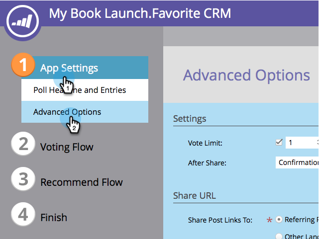

# Customize Poll Settings {#customize-poll-settings}

When you [create a poll](/help/marketo/product-docs/demand-generation/social/creating-a-poll/create-a-poll.md), you can limit the number of votes allowed per social profile.

>[!IMPORTANT]
>
>On July 31, 2024, we began the process of deprecating this feature. You won't be able to create new assets. Existing assets will continue to work through January 31, 2025. [Learn more](https://nation.marketo.com/t5/employee-blogs/marketo-engage-social-features-deprecation/ba-p/351977){target="_blank"}

1. Go to **Marketing Activities**.

   

1. Select the poll, and click **Edit Draft**.

   

1. In the poll editor, go to **App Settings** > **Advanced Options**.

   

1. Check the option to impose a **Vote Limit** and enter the maximum number of votes allowed.

   

>[!TIP]
>
>You can click **Finish** > **Approve and Close** to [publish your poll](/help/marketo/product-docs/demand-generation/social/creating-a-poll/publish-a-poll.md), or you can continue customizing it. For example, try [configuring the after-share prompts](/help/marketo/product-docs/demand-generation/social/configuring-social-actions/configure-after-share-prompts.md).
