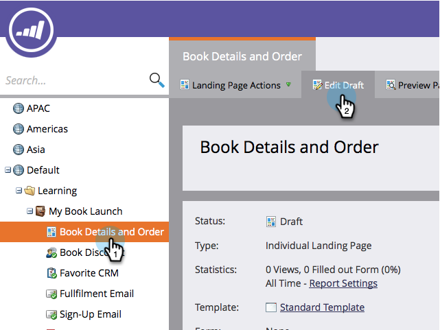
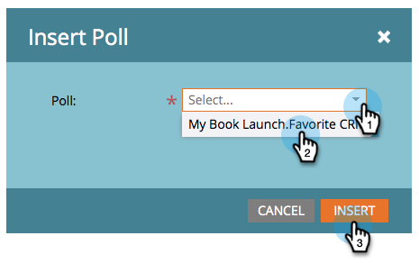

# Publish a Poll {#publish-a-poll}

After you [create a poll](/help/marketo/product-docs/demand-generation/social/creating-a-poll/create-a-poll.md), you can publish it on your Marketo Landing Pages, on Facebook, and on your website.

>[!IMPORTANT]
>
>On July 31, 2024, we began the process of deprecating this feature. New assets can no longer be created. Existing assets will continue to work through January 31, 2025. [Learn more](https://nation.marketo.com/t5/employee-blogs/marketo-engage-social-features-deprecation/ba-p/351977){target="_blank"}

1. Navigate to your Landing Page and open it for editing.

   

1. Drag over **Poll** from the palette on the right.

   

1. Select your poll and click **Insert**.

   

>[!NOTE]
>
>You need to approve your poll in order to make it available here.

Congratulations! Approve the Landing Page and your poll is live. You can also [publish the Landing Page to Facebook](/help/marketo/product-docs/demand-generation/facebook/publish-landing-pages-to-facebook.md) or [put the poll on your website](/help/marketo/product-docs/demand-generation/social/social-functions/deploy-social-on-your-website.md).

>[!TIP]
>
>Test and refine your poll. Go to the poll on your web page and sign up with test info. Make note of everything you want to change about the user's experience.
