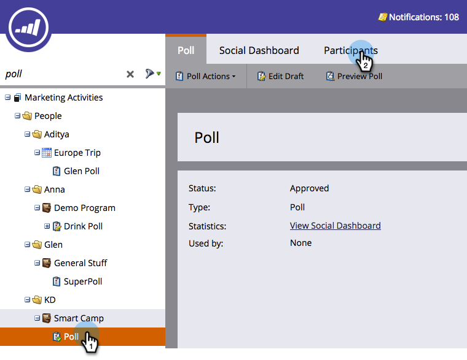
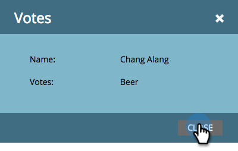

# Review Votes Cast in Poll {#review-votes-cast-in-poll}

Who voted for what in your poll? Let's find out.

1. In **[!UICONTROL Marketing Activities]**, select the **[!UICONTROL Poll]**, and click the **[!UICONTROL Participants]** tab.

   

1. Click the number in the ****[!UICONTROL Votes]* column.

   

1. What they voted on will be displayed. Click **[!UICONTROL Close]**.

   

   >[!MORELIKETHIS]
   >
   >Learn more about the social reach and impact of your apps in [View Social Performance](/help/marketo/product-docs/demand-generation/social/social-functions/view-social-performance.md).
