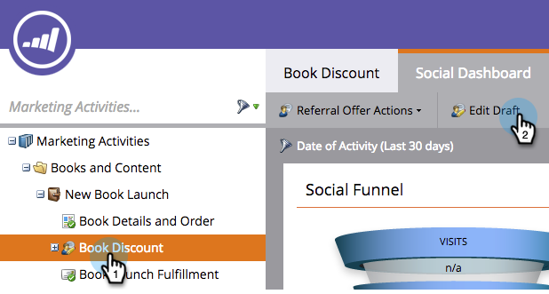
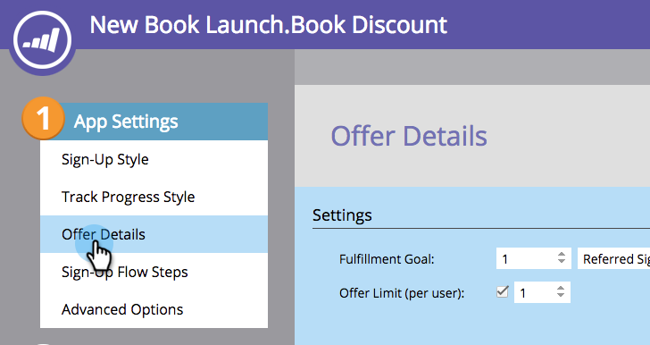
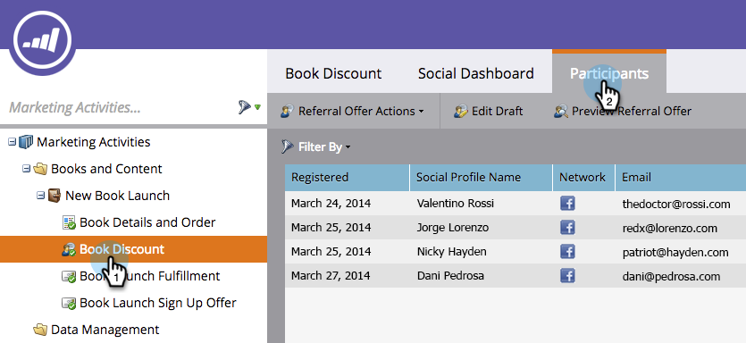
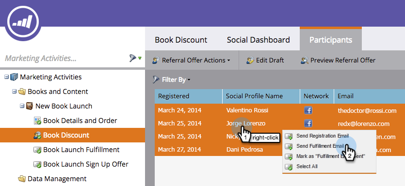

# Send Referral Offer Fulfillment Email {#send-referral-offer-fulfillment-email}

Reward your customers with coupons and discount codes using the offer fulfillment email.

>[!PREREQUISITES]
>
>* [Use Emails in Social Promotions](/help/marketo/product-docs/demand-generation/social/social-functions/use-emails-in-social-promotions.md)
>* [Create a Referral Offer](/help/marketo/product-docs/demand-generation/social/referral-offers/create-a-referral-offer.md)

## Set Up Fulfillment Delivery {#set-up-fulfillment-delivery}

1. Select the referral offer. Click **[!UICONTROL Edit Draft]**.

   

1. Under **[!UICONTROL App Settings]**, select **[!UICONTROL Offer Details]**.

   

1. Select a **[!UICONTROL Sign-Up Email]**.

   

1. Select a **[!UICONTROL Fulfillment Email]**.

   

   >[!NOTE]
   >
   >Learn more about [using emails in social promotions](/help/marketo/product-docs/demand-generation/social/social-functions/use-emails-in-social-promotions.md).

1. Click the **[!UICONTROL Fulfillment Delivery]** drop-down and select **[!UICONTROL auto on goal]**.

   

   The message selected within **[!UICONTROL Fulfillment Email]** will be automatically sent to people who meet the goal.

## Manual Send {#manual-send}

You can send a fulfillment email manually to a person once they've met the goal.

1. Select the referral offer and click the **[!UICONTROL Participants]** tab.

   

1. Click the **[!UICONTROL Filter By]** option and select **[!UICONTROL Goal]**.

   >[!NOTE]
   >
   >This selects people who have met the referral offer goal.

   

1. Select the people in the filtered view.

   

1. Right-click and select **[!UICONTROL Send Fulfillment Email]**.

   

Awesome! Those people will now receive the fulfillment email and be stoked about their reward.
