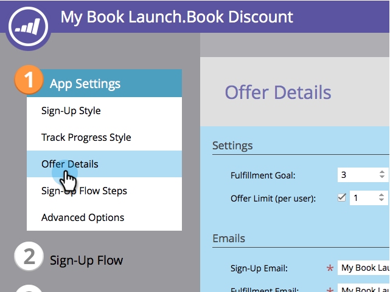

# Specify Goal for Referral Offer {#specify-goal-for-referral-offer}

When you [create a referral offer](create-a-referral-offer.md), you need to define the fulfillment goal. The goal can be defined by person activity on the web page, such as page visits or sign-ups. You can even use a [custom JavaScript event](../../../../product-docs/demand-generation/social/social-functions/conversion-script-for-custom-events.md).

Alternatively, you can use a [smart list trigger](specify-goal-for-referral-offer.md) in Marketo to wait for any milestone, such as an opportunity being created for the referred person.

Example goals:

* 10 referred visits
* 5 referred sign-ups
* 1 referred opportunity created
* 2 referred ecommerce purchases
* 5 referred webinar attendees

1. Go to **Marketing Activities**.

   

1. Select the referral offer, and click **Edit Draft.**

   

1. In the referral offer editor, go to **App Settings** > **Offer Details.**

   

1. Under **Settings**, choose an event type from the **Fulfillment Goal** drop-down.

   

>[!TIP]
>
>If you plan to use the **Give Credit to Referrer** flow step, you must select **Smart List Trigger** as the fulfillment goal type here.

* Referred Visits: Offer participants get credit for each visit from a friend to the page hosting your offer.
* Referred Sign-Ups: Offer participants get credit for each friend who signs up for the offer.
* Smart List Trigger: Offer participants get credit for each friend who meets the conditions of a [smart list](../../../../product-docs/core-marketo-concepts/smart-lists-and-static-lists/understanding-smart-lists.md) trigger in a [smart campaign](http://docs.marketo.com/display/docs/smart+campaigns). For example, you can use a trigger that fires when a referred prospect signs up for a webinar.

* Custom JavaScript Event: Offer participants get credit for each friend who triggers a defined JavaScript event on your page. See [Conversion Script for Custom Events](../../../../product-docs/demand-generation/social/social-functions/triggers-and-filters-for-social-activities.md).

>[!NOTE]
>
>There are new filters and triggers available in smart campaigns to monitor social activity. See&nbsp; [use triggers and filters for social activities](../../../../product-docs/demand-generation/social/social-functions/triggers-and-filters-for-social-activities.md).

>[!NOTE]
>
>**Related Articles**
>
>Next, you can [select the sign-up and fulfillment emails](send-referral-offer-fulfillment-email.md) to send from your referral offer.

