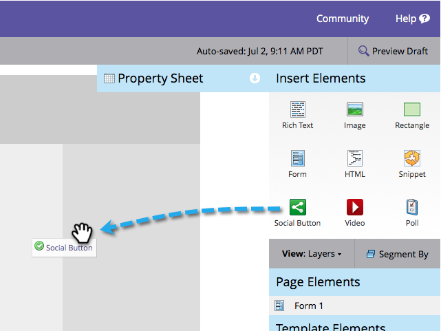

# Add a Social Button on a Landing Page {#add-a-social-button-on-a-landing-page}

A social button encourages people to share your content with their friends. Drop it on landing pages, Facebook, and your website.

>[!AVAILABILITY]
>
>Not all customers have purchased this functionality. Contact your sales rep for details.

1. Navigate to your landing page and click **Edit Draft**.

   

1. Drag over the **Social Button** from the elements on the right.

   

1. Select **Social Buttons (with Analytics)**.

   

   Once your landing page is active, see the activity generated by your **Social Button** (with Analytics) on the [Social Dashboard](/help/marketo/product-docs/demand-generation/social/social-functions/view-social-performance.md).

   If you add a **Like/Recommend Button (Lite)** instead, see the number of shares in the [landing page performance report](/help/marketo/product-docs/demand-generation/landing-pages/understanding-landing-pages/landing-page-performance-report.md).

1. Select **Create New** from the drop-down.

   >[!NOTE]
   >
   >You can also create a social button inside a program by selecting **New** > **New Local Asset**.

1. Name your social button, select **None** from **Clone** **From**, and click **Insert**.

   

Congratulations! You have added a social button to your landing page. Be sure to approve the landing page. You can also [publish the landing page to Facebook](/help/marketo/product-docs/demand-generation/facebook/publish-landing-pages-to-facebook.md) or [put the social button on your website](/help/marketo/product-docs/demand-generation/social/social-functions/deploy-social-on-your-website.md).  

>[!TIP]
>
>To save time, you can use the **Clone From** option to copy all settings from an existing social button.

>[!MORELIKETHIS]
>
>You're done, but you can change the settings of your social button if necessary. Start with [customizing the button style](/help/marketo/product-docs/demand-generation/social/configuring-social-actions/customize-social-app-button.md) and [editing the share messages](/help/marketo/product-docs/demand-generation/social/configuring-social-actions/configure-social-sign-up-share-flow.md) it presents.
