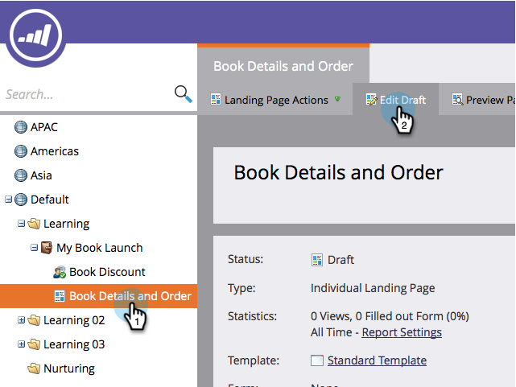
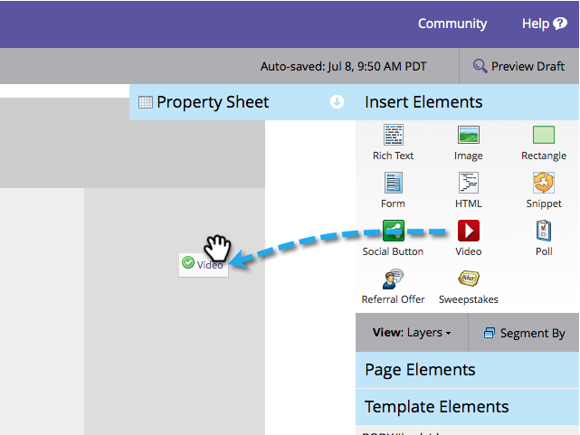
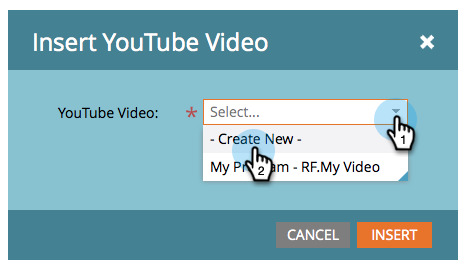
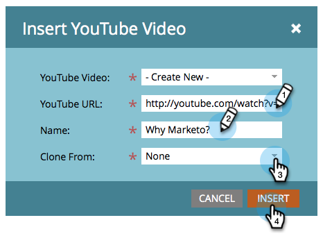

# Add a Video {#add-a-video}

Put videos with social sharing options on your landing pages.

>[!AVAILABILITY]
>
>Not all customers have purchased this functionality. Contact your sales rep for details.

1. Navigate to your landing page and click **Edit Draft**.

   

1. Drag over **Video** from the elements on the right.

   

1. Select **Create New** from the drop-down.

   

   >[!NOTE]
   >
   >You can also create a video share _inside a program_ by selecting **New** > **New Local Asset**. You can then select it from the drop-down, as shown here.

1. Enter the URL of the YouTube video and name your video share. Under the **Clone From** option select **None** and click **Insert**.

   

>[!TIP]
>
>To save time, you can use the **Clone From** option to copy all settings from an existing video share.

Congratulations! You have added a video share to your landing page. Approve the landing page and your video share is live. You can also [publish the landing page to Facebook](/help/marketo/product-docs/demand-generation/facebook/publish-landing-pages-to-facebook.md) or [put the video share on your web site](/help/marketo/product-docs/demand-generation/social/configuring-social-actions/customize-video-share-flow.md).

>[!MORELIKETHIS]
>
>You're done, but you can change the settings of your video share if necessary. Start with [customizing the share flow](/help/marketo/product-docs/demand-generation/social/configuring-social-actions/customize-video-share-flow.md) (when and where the share prompt opens).
