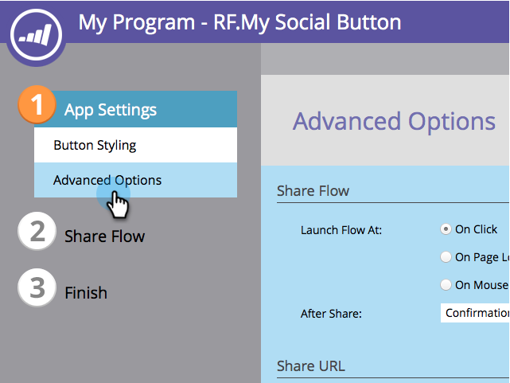

# Add Your Privacy Policy to a Social App {#add-your-privacy-policy-to-a-social-app}

When you create a&nbsp; [social app](http://docs.marketo.com/display/docs/social), you can add a link to your company’s privacy policy.

1. Go to **Marketing Activities**.

   

1. Select the app, and click **Edit Draft****.**

   

1. In the social app editor, go to **App Settings** > **Advanced Options****.**

   

1. To add a link to your privacy policy, select the checkbox, edit the title, and enter the URL.

   

   >[!NOTE]
   >
   >On this screen, you can also add a link to the rules (terms and conditions) of your offer. See [Create a Referral Offer](../../../../product-docs/demand-generation/social/referral-offers/create-a-referral-offer.md).

1. The privacy policy link (and the rules link) will appear in the bottom of share message screens. For example:

   

Next, you can [configure the social sign-up and share flow](../../../../product-docs/demand-generation/social/configuring-social-actions/configure-social-recommend-flow.md) of your app.
