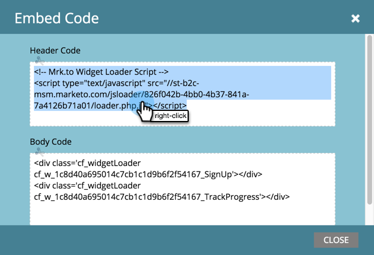

# Conversion Script for Custom Events {#conversion-script-for-custom-events}

You define the fulfillment goal when creating a referral offer.&nbsp;If the action that counts towards the goal is a specific event on your own web page, you can use a conversion script to call our JavaScript API.

## Retrieve the Conversion Script {#retrieve-the-conversion-script}

1. Within the referral offer editor, click **Offer Details** and then select **Customer JavaScript Event** from the fulfillment goal drop down.

   

1. Copy the top script in the grey box and place it on your webpage within the <body> tags. The bottom script is placed within the <header> tags.

   

   >[!NOTE]
   >
   >**Reminder**
   >
   >
   >Remember to copy and paste both scripts if they are going on a non-Marketo website.

## Retrieve the Loader Script {#retrieve-the-loader-script}

1. Select the referral offer from the tree, then click **Referral Offer Actions** and **Embed Code**.

   

1. Right-click the **Header Code** and insert it into your webpage header. Then do the same for the **Body Code**.

   

## Pasting the Scripts Onto Your Webpage {#pasting-the-scripts-onto-your-webpage}

##### Paste the conversion scripts into the HTML for the body and header. Next, place the loader scripts into the HTML for the body and header. {#paste-the-conversion-scripts-into-the-html-for-the-body-and-header-next-place-the-loader-scripts-into-the-html-for-the-body-and-header}

## Connecting the Conversion Script {#connecting-the-conversion-script}

##### Here's where you will write a JavaScript function that uses the specific HTML id of whatever page element you want to trigger goal completion on. For example: {#heres-where-you-will-write-a-javascript-function-that-uses-the-specific-html-id-of-whatever-page-element-you-want-to-trigger-goal-completion-on-for-example}

`<pre><em><!-- Referral offer conversion script --></em> </pre>` `<pre>` In this example there is a button on the webpage with an id of "#myButtonId." When that button is clicked, the person will be registered as having completed the goal.

Awesome! Your website is now capturing custom social promotion goals with Marketo.

>[!NOTE]
>
>**Related Articles**
>
>* [Specify Goal for Referral Offer](../../../../product-docs/demand-generation/social/referral-offers/specify-goal-for-referral-offer.md)
>* [Create a Referral Offer](../../../../product-docs/demand-generation/social/referral-offers/create-a-referral-offer.md)
>* [Deploy Social on Your Website](deploy-social-on-your-website.md)
>

