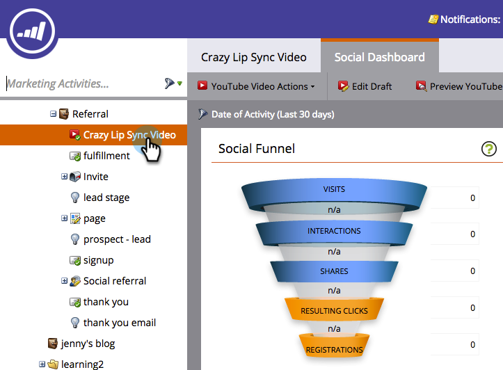
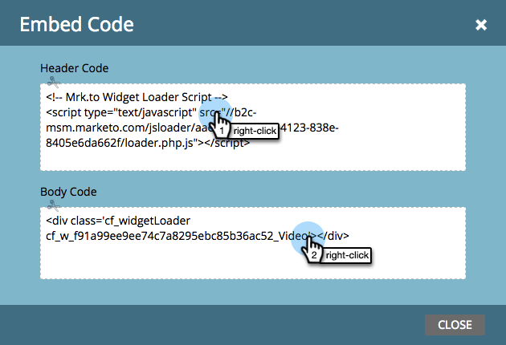
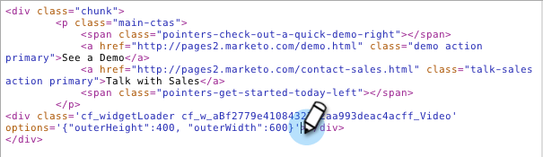

# Deploy Social on Your Website {#deploy-social-on-your-website}

Embed social apps on your non-Marketo pages.

>[!AVAILABILITY]
>
>Contact your sales rep for more details.

You can deploy social apps on your own website to engage your audience and bring everyone into the larger conversation on social networks. As people share your promotions and content with their friends on social networks, you generate more traffic on your site.

1. Select an approved social app, such as a YouTube Video or Social Button.

   

1. Select **Embed Code** from Social App Actions.

   

1. Copy the code for your site's page header (`<head>`) and body (`<body>`).

   

1. Paste the first code snippet into your website's page header.

   

1. Paste the second code snippet into each page, where you want your social app to appear in the page.

   

1. If you need to set the size of the social app to specific dimensions on your page, add the **outerHeight** and **outerWidth** options to the second code snippet. For example, you can add `options='{"outerHeight":400, "outerWidth":600}'`, as in:

   

   Your Marketo social app now adds content and interactivity to your website, inviting fans, visitors, and existing customers to spread the word about you. At the same time, it adds their profile data to your database and tracks social influence metrics.

   >[!MORELIKETHIS]
   >
   >* [Customize Social App Button](/help/marketo/product-docs/demand-generation/social/configuring-social-actions/customize-social-app-button.md)
   >* [Set Social Share Requirement](/help/marketo/product-docs/demand-generation/social/social-functions/set-social-share-requirement.md)
   >* [Publish Landing Pages to Facebook](/help/marketo/product-docs/demand-generation/facebook/publish-landing-pages-to-facebook.md)
