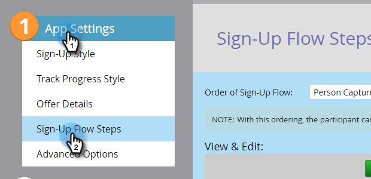

# Set Social Share Requirement {#set-social-share-requirement}

When you [create a referral offer](/help/marketo/product-docs/demand-generation/social/referral-offers/create-a-referral-offer.md), you can require people to share the offer in order to sign up, or make it optional.

1. Go to **[!UICONTROL Marketing Activities]**.

   

1. Select the referral offer, and click **[!UICONTROL Edit Draft]**.

   

1. In the referral offer editor, go to **[!UICONTROL App Settings]** and then **[!UICONTROL Sign-Up Flow Steps]**.

   

1. Select the order of sign-up flow.

   

    * **[!UICONTROL Person Capture > Share]**: Person can skip sharing and just sign up.
    * **[!UICONTROL Share > Person Capture]**: Person must share in order to sign up.

1. For each option, see the preview in the **[!UICONTROL View & Edit]** window.

   
