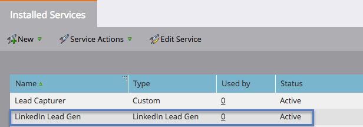

# Set up LinkedIn Lead Gen Forms {#set-up-linkedin-lead-gen-forms}

Use LinkedIn Lead Gen Forms to run ad campaigns in LinkedIn and generate leads for Marketo.

>[!IMPORTANT]
>
>LinkedIn is upgrading their Marketing APIs used by Marketo Engage LinkedIn integrations. These changes will require re-authentication of all LinkedIn LaunchPoint services in your **Admin** > **LaunchPoint** menu between June 7 and December 15, 2024, to avoid service interruption. For more information, please see the [Migration FAQ](https://nation.marketo.com/t5/employee-blogs/linkedin-re-authentication-required/ba-p/347794){target="_blank"}.

>[!NOTE]
>
>**Admin Permissions Required**

>[!NOTE]
>
>A LinkedIn lead will not come into Marketo Engage if it matches an existing person record in Marketo that's associated with a company record created using Company APIs, and the Marketo subscription is not connected to a CRM.

1. Go to the **[!UICONTROL Admin]** area.

   

1. Go to **[!UICONTROL LaunchPoint]**, click **[!UICONTROL New]** and select **[!UICONTROL New Service]**.

   

1. Enter a _Display Name_ for your service, select the **[!UICONTROL LinkedIn Lead Gen]** service from the drop-down, and click **[!UICONTROL Next]**.

   

1. Marketo opens a new tab in the same browser to [linkedin.com](https://www.linkedin.com){target="_blank"}. Log in to LinkedIn using the account you want to use for the integration.

   >[!NOTE]
   >
   >The LinkedIn account needs access to all the LinkedIn Business Accounts that you are creating sponsored campaigns for.

   

1. After you're logged into LinkedIn, return to Marketo and click **[!UICONTROL Authorize]**.

   

1. When prompted, click **[!UICONTROL Allow]** to accept the Marketo app installation into LinkedIn.

   

1. You'll notice you are now authorized. Click **[!UICONTROL Next]**.

   

   >[!CAUTION]
   >
   >The service automatically expires one year after authorization. To regain access, simply click **[!UICONTROL Re-Authorize]**. You may have to re-enter your LinkedIn password, depending on your browser settings.

1. Select the account(s) you want LinkedIn Lead Gen leads to come into Marketo from and click **[!UICONTROL Next]**.

   >[!TIP]
   >
   >If you don't see the Business Accounts that you're expecting, make sure that the user's LinkedIn account that is being authorized has Lead Gen Form Manager Permissions to the Business Account in LinkedIn.

   

1. To accept default LinkedIn to Marketo field mappings, simply click **[!UICONTROL Create]**. If you would like to change the default field mapping, remove a field mapping, or add a new field mapping, you can do this on a per field basis through the modal below.

   >[!CAUTION]
   >
   >Marketo supports mapping two LinkedIn fields to a single Marketo field, _but only when_ the two LinkedIn fields are not on the same form. If you map two fields from the same LinkedIn form to a single Marketo field, people may fail to enter your Marketo database.

   

   >[!NOTE]
   >
   >Only LinkedIn fields that have already been saved to a [form template](https://www.linkedin.com/help/lms/answer/79634){target="_blank"} in LinkedIn Campaign Manager will show up as LinkedIn Fields that can be mapped to Marketo fields.

   

Nicely done! People who submit LinkedIn Lead Gen forms will start flowing into Marketo as you run successful campaigns on the LinkedIn side.

>[!NOTE]
>
>You can only authorize a single LinkedIn user account. If you have multiple Business Accounts that you would like to link to Marketo, make sure that the user's LinkedIn account that's being authorized has Lead Gen Form Manager Permissions to the Business Account in LinkedIn.

>[!MORELIKETHIS]
>
>[Use LinkedIn Lead Gen Form Filters and Triggers in a Smart Campaign](/help/marketo/product-docs/demand-generation/social/social-functions/use-linkedin-lead-gen-form-filters-and-triggers-in-a-smart-campaign.md){target="_blank"}
