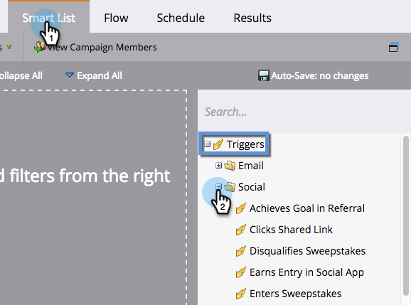

# Triggers and Filters for Social Activities {#triggers-and-filters-for-social-activities}

Social apps in Marketo have their own special triggers and filters.

>[!AVAILABILITY]
>
>Not all customers have purchased this functionality. Contact your sales rep for details.

1. To use social _triggers_, select your smart campaign and click the **Smart List** tab. On the right, click the + to expand **Triggers**, then **Social**.

   

1. To use social _filters_, click the **+** to expand the **Filters**.

   

1. Reference the table below to see which triggers and filters work with each social app.

   | Triggers/Filters |Social Buttons |Polls |Videos |Referral Offers |Sweepstakes |
   |---|---|---|---|---|---|
   | Achieved Goal in Referral |  |  |  | | |
   | Shares Content |  |   |   |   |  |
   | Clicks Shared Link |  |   |  |  |   |
   | Disqualifies Sweepstakes |  |  |  |  |   |
   | Earns Entry in Social App |  |  |  |  |  |
   | Enters Sweepstakes |  |  |  |  |   |
   | Refers to Social App |  |  |  |  |   |
   | Signs up for Referral Offer |  |  |  |  |  |
   | Votes in Poll |  |  |  |  |  |
   | Wins Sweepstakes |  |  |  |  |  |

   >[!MORELIKETHIS]
   >
   >[View Social Performance](/help/marketo/product-docs/demand-generation/social/social-functions/view-social-performance.md)
