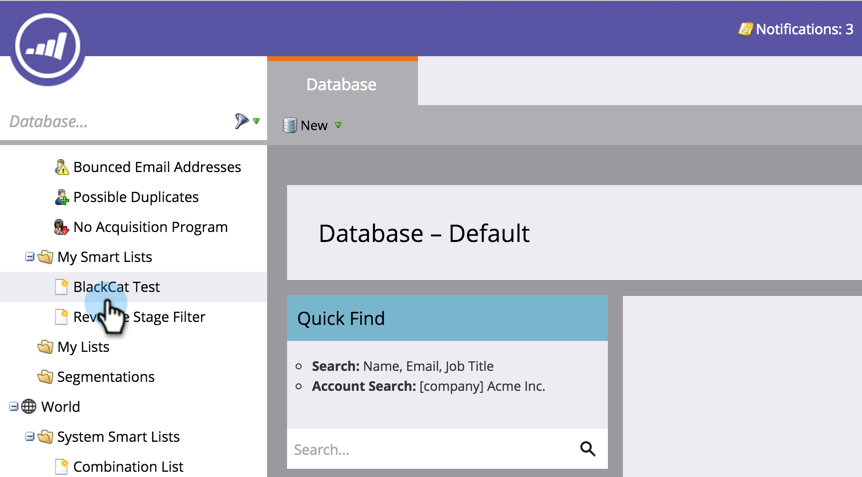
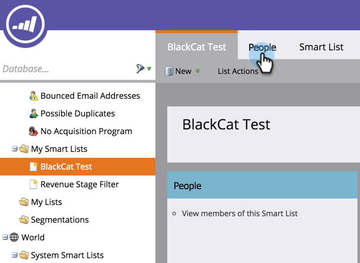
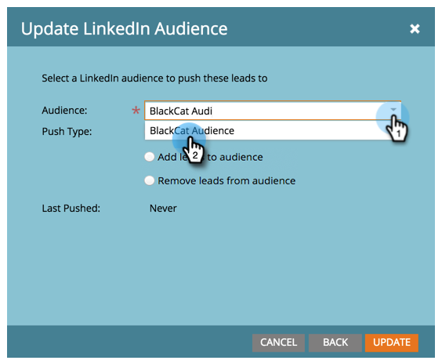

# Use a Marketo List or Smart List as a LinkedIn Audience Segment {#use-a-marketo-list-or-smart-list-as-a-linkedin-audience-segment}

Integrate your Marketo people with your LinkedIn audiences.

>[!PREREQUISITES]
>
>[Add LinkedIn Matched Audiences as a LaunchPoint Service](/help/marketo/product-docs/demand-generation/ad-network-integrations/add-linkedin-matched-audiences-as-a-launchpoint-service.md)

1. Go to the **Database**.

   

1. Select a smart list.

   

1. Click the **People** tab.

   

1. Click the **Send Via Ad Bridge** icon  at the bottom of the list.

   

   >[!NOTE]
   >
   >When using ad network integrations to send an audience to LinkedIn, Marketo only sends the email address over.

1. Select **LinkedIn** and click **Next**.

   

1. Select a **LinkedIn Audience**.

   >[!NOTE]
   >
   >Clicking **+New Audience** will create an audience in LinkedIn Campaign Manager.

   

   >[!NOTE]
   >
   >LinkedIn deprecated the APIs used for the “Clear audience and add leads” push type in March 2018. This option is no longer available as of Marketo's Q1 2018 Release.

1. Select a **Push Type**. Click **Update**.

   

   >[!NOTE]
   >
   >Please allow 15 minutes for the sync to take place.

High five! Your data will now jibe with LinkedIn's audiences. For information on uploading lists to LinkedIn for Account and Contact Targeting, visit [LinkedIn's Marketing Solutions help center](https://www.linkedin.com/help/lms/answer/73938?query=ad%20segment).
