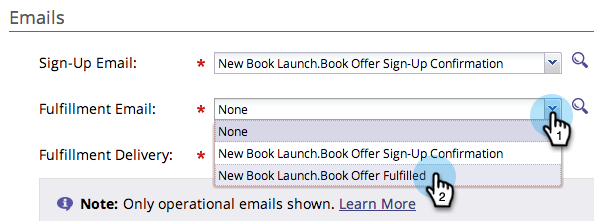
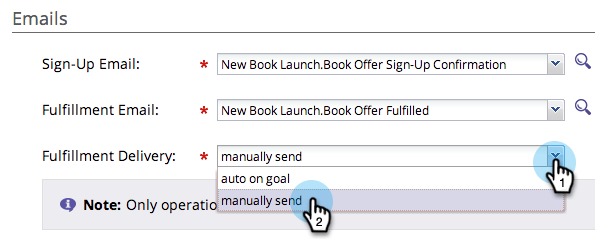

# Use Emails in Social Promotions {#use-emails-in-social-promotions}

When you create a [referral offer](../../../../product-docs/demand-generation/social/referral-offers/create-a-referral-offer.md) or a [sweepstakes](../../../../product-docs/demand-generation/social/sweepstakes/create-sweepstakes.md), you can include emails to send when the person signs up, and again when the person has won the reward.

>[!TIP]
>
>To create an email, see  [Send an Email Blast](../../../../getting-started/quick-wins/send-an-email.md).

In the emails, use these tokens:

* **Sign-up email**: Use **`{{social.Share Url}}`** to send each participating person a personalized share link.

* **Fulfillment email**: Use **`{{social.Promo Code}}`** to send each winner a [promo code](use-promo-codes-for-offer-fulfillment.md).

>[!PREREQUISITES]
>
>Before you can add an email to a social app, it must be *operational* and *approved*. See  [Edit Settings for an Email](../../../../product-docs/email-marketing/general/functions-in-the-editor/make-an-email-operational.md).

1. Go to **Marketing Activities**.

   

1. Select the app, and click **Edit Draft**.

   

1. In the social app editor, go to **App Settings > Offer Details** (or **Sweepstakes Details**).

   

1. Add the sign-up email.

   

   >[!NOTE]
   >
   >The confirmation email is sent automatically when a person signs up.

1. Add the fulfillment email.

   

1. In a referral offer, choose whether the fulfillment email is sent automatically or manually.

   

>[!NOTE]
>
>In a sweepstakes, the fulfillment email is always sent automatically when you  [select the winner](../../../../product-docs/demand-generation/social/sweepstakes/select-sweepstakes-winners.md).

>[!NOTE]
>
>**Definition**
>
>* **auto on goal**: The fulfillment email is sent automatically as each participant meets the goal.
>* **manually send**: Once people start meeting the goal, return to your referral offer to manually [send the fulfillment email](../../../../product-docs/demand-generation/social/referral-offers/send-referral-offer-fulfillment-email.md).
>

>[!NOTE]
>
>**Related Articles**
>
>Next, you can [choose the share URL](choose-the-share-url-for-a-social-app.md) or, in your referral offer, you can [upload the promo codes](use-promo-codes-for-offer-fulfillment.md) you will send out.

