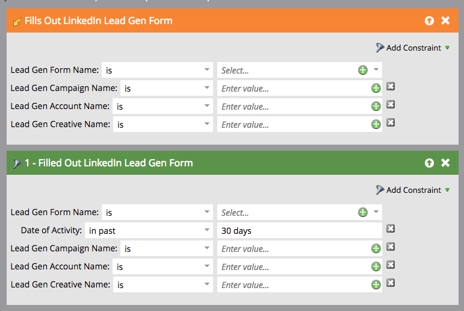

# Use LinkedIn Lead Gen Form Filters and Triggers in a Smart Campaign {#use-linkedin-lead-gen-form-filters-and-triggers-in-a-smart-campaign}

When you've enabled LinkedIn Lead Gen Forms, you can use them as filters and triggers in your smart campaigns.

>[!NOTE]
>
>When people submit their information in a LinkedIn Lead Gen Form, that information is pushed to Marketo immediately, making the form available in the Lead Gen Form Name drop-down. Form names won't be visible until at least one person has submitted the form.

1. Use the **Fills Out LinkedIn Lead Gen Form** trigger to take action immediately or the **Filled Out LinkedIn Lead Gen Form** filter for scheduled batch campaigns or standard smart list filtering.

   

1. Add constraints to further confine your results.

   
