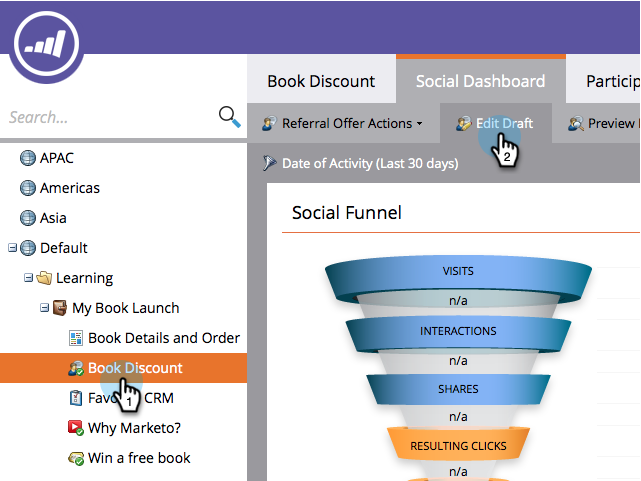
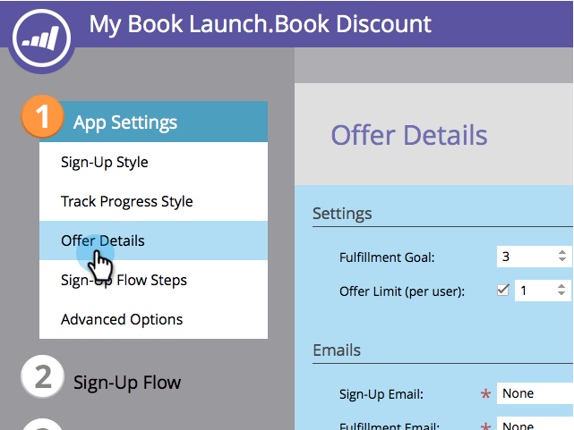
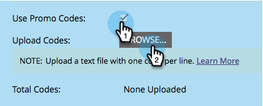

# Use Promo Codes for Offer Fulfillment {#use-promo-codes-for-offer-fulfillment}

When you create a referral offer or a sweepstakes, you can send a promo (coupon) code to each winner. To redeem their reward, they use the code, for example, on the checkout page of a purchase on your site.

## Upload Promo Codes {#upload-promo-codes}

1. Go to **[!UICONTROL Marketing Activities]**.

   

1. Select the referral offer, and click **[!UICONTROL Edit Draft]**.

   

1. In the referral offer editor, go to **[!UICONTROL App Settings]** and then **[!UICONTROL Offer Details]**.

   

1. Under [!UICONTROL Emails], select **[!UICONTROL Use Promo Codes]**, and under **[!UICONTROL Upload Codes]**, click **[!UICONTROL Browse]** to select the promo codes file from your system.

   

1. The promo codes file must be a plain ASCII text file with one code per line and a .txt filename extension. For example:

   

   >[!CAUTION]
   >
   >Any white space in the promo codes file is treated as part of the code on that line. Be especially careful to avoid trailing spaces at the end of each line.

1. When the upload is complete, the total number of uploaded codes is displayed.

   

## Review Sent Promo Codes {#review-sent-promo-codes}

Once participants start earning your offer reward, you can see which promo codes were sent to whom and when.

>[!NOTE]
>
>Only Marketo users with _Access Awards_ permission have access to this information. See  [Managing User Roles and Permissions](/help/marketo/product-docs/administration/users-and-roles/managing-user-roles-and-permissions.md).

1. Go to **[!UICONTROL Marketing Activities]**.

   

1. Select your referral offer or sweepstakes, and click the **[!UICONTROL Participants]** tab.

   

1. Here you should see some entries. Click the number in the **[!UICONTROL Promo Codes]** column to see the promo codes that were sent to that participant, and when.

   
