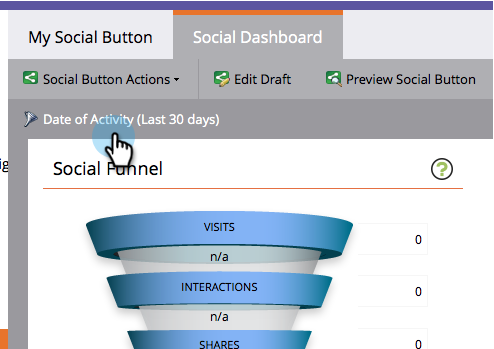
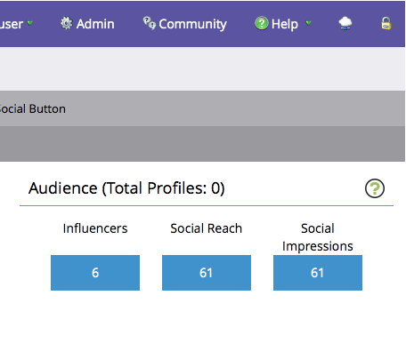
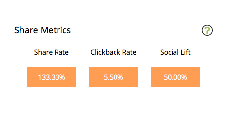

# View Social Performance {#view-social-performance}

See the social activities generated by your social apps. The Social Dashboard gives you insight into the various social interactions that are generated by your social apps, and allows you to track the performance of a social app.

>[!AVAILABILITY]
>
>Not all customers have purchased this functionality. Contact your sales rep for details.

1. Go to **[!UICONTROL Marketing Activities]**.

   

1. Select the social app.

   

1. Click **[!UICONTROL Date of Activity]**.

   

1. Select the time interval.

   

   >[!NOTE]
   >
   >If you select **[!UICONTROL Last 24 hours]**, metrics are calculated hourly, at the top of the hour. For all other intervals, metrics are run daily, at midnight of the previous day.

1. Use the **[!UICONTROL Social Funnel]** to review your promotion's social progression and effectiveness.

    * **[!UICONTROL Campaign Visits]**: The number of times that prospects load a page that contains your social app.
    * **[!UICONTROL Interactions]**: The number of times prospects have interacted with your social app, such as signing up for a [referral offer](/help/marketo/product-docs/demand-generation/social/referral-offers/create-a-referral-offer.md), voting in a [poll](/help/marketo/product-docs/demand-generation/social/creating-a-poll/create-a-poll.md), [sharing a video](/help/marketo/product-docs/demand-generation/landing-pages/free-form-landing-pages/add-a-video-to-a-free-form-landing-page.md), etc.
    * **[!UICONTROL Shares]**: The number of times prospects share a message to their social network from your social app.
    * **[!UICONTROL Resulting Clicks]**: The number of times prospects clicked links in shares from your social app.
    * **[!UICONTROL Registration]**: The number of prospects who sign up for your promotion after following a shared link back to your app.

   >[!NOTE]
   >
   >Visits to a page with multiple social apps count as one visit to each. Visits to multiple pages within the same app count as one visit. Visits after more than 30 minutes, or a browser restart, are counted as new.

   

1. Use the **[!UICONTROL Audience]** panel to review how your prospects are helping you get the word out.

    * **[!UICONTROL Total Profiles]**: The total number of prospects who have signed in to social networks from your social app.
    * **[!UICONTROL Influencers]**: The number of prospects who have generated at least one resulting click from an app share.
    * **[!UICONTROL Social Reach]**: The sum of all the prospects’ connections. For prospects who share to social networks, this is the number of friends they have at the time they shared from your social app. For email sharing, this is the number of recipients of the email they generate from your app.
    * **[!UICONTROL Social Impressions]**: The total number of times that your social app appeared in the feeds of prospects’ connections.

   

1. Use the **[!UICONTROL Share Metrics]** panel to review the aggregated social activity generated by your social app.

    * **[!UICONTROL Share Rate]**: The percentage of visits to your app that generate a share.
    * **[!UICONTROL Clickback Rate]**: The number of resulting clicks per share.
    * **[!UICONTROL Social Lift]**: The ratio of visits to your app (coming from the link in shares) to the number of non-social visits (from sources other than your social app).

   

>[!MORELIKETHIS]
>
>You can also use triggers and filters to see who is sharing your content and interacting with your social apps so you can act on those interactions. See [Use Triggers and Filters for Social Activities](/help/marketo/product-docs/demand-generation/social/social-functions/triggers-and-filters-for-social-activities.md).
