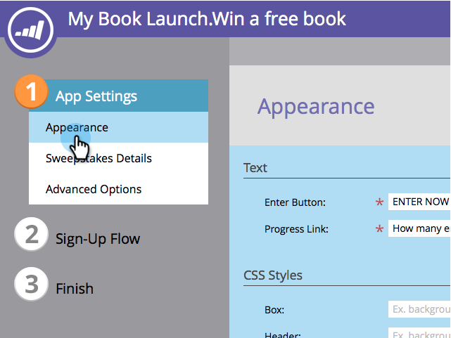
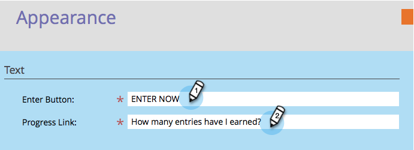
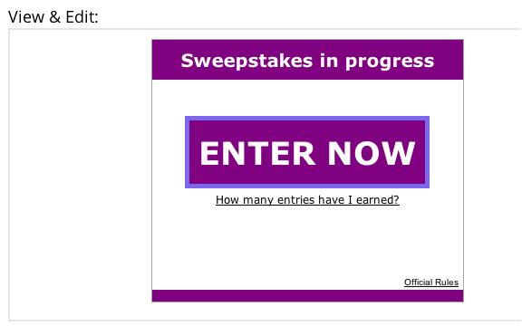

# Customize Sweepstakes Styles {#customize-sweepstakes-styles}

When you [create a sweepstakes](/help/marketo/product-docs/demand-generation/social/sweepstakes/create-sweepstakes.md), you can customize how it looks on your landing page.

>[!AVAILABILITY]
>
>Not all customers have purchased this functionality. Contact your sales rep for details.

1. Go to **Marketing Activities**.

1. Select the sweepstakes, and click **Edit Draft**.

   

1. In the Sweepstakes editor, go to **App Settings** > **Appearance**.

   

1. Edit the text of your sign-up button and the progress link.

   

1. For each element that you wish to customize, enter your custom CSS properties.

   

   Example CSS for **Enter Button**:
   `<pre>border: 5px solid #7B68EE; background-color: purple; padding: 10px; font: 16px; color: #FFFFFF; text-align: center;</pre>`

   Example Image for **Enter Button**:
   `<pre>background:url(https://app.marketo.com/images/public-site/button_sign-up-now.png) no-repeat center center; width:275px; height:95px; margin:auto; display:block;</pre>` `<pre>`

   >[!NOTE]
   >
   >If you use an image with text on it, remember to remove the text from the **Enter Button** field under Text above.

1. As you make each change, the result is displayed in the View & Edit preview.

   

   >[!NOTE]
   >
   >Test your button in several different browsers, including older versions.

   >[!MORELIKETHIS]
   >
   >The next step is to add [sign-up and fulfillment emails to your sweepstakes](/help/marketo/product-docs/demand-generation/social/social-functions/use-emails-in-social-promotions.md).
