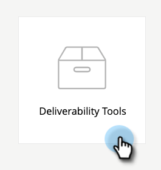
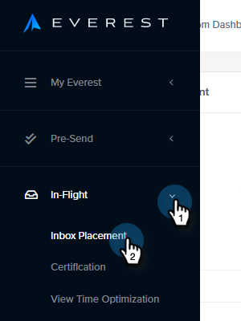
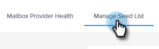
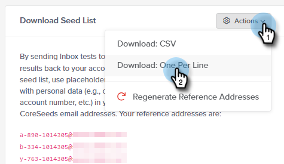

# Email Deliverability Power Pack: How to Import a Seed List {#email-deliverability-power-pack-how-to-import-a-seed-list}

A Seed List is a list of email accounts at multiple mailbox providers, including Google Apps, Hotmail, Yahoo!, etc., that are used to approximate the rate of inbox versus spam folder deliverability. Here’s how to get that list into your Marketo instance.

>[!AVAILABILITY]
>
>Not all Marketo Engage users have purchased this functionality. Contact the Adobe Account Team (your Account Manager) for details.

## Import a Seed List {#import-a-seed-list}

1. In your My Marketo, select **Deliverability Tools**.

   

1. The Everest application will open. In the left nav, click **In-Flight** and select **Inbox Placement**.

   

1. Click the **Manage Seed List** tab.

   

1. Click the Actions drop-down and select **Download One Per Line**.

   

   >[!NOTE]
   >
   >Use the Seed List Optimizer (at the top of the page) if you want Everest to optimize your list for you.

1. After export, the list will appear as a .txt file in your browser’s downloads folder. Retrieve it, and [import](/help/marketo/getting-started/quick-wins/import-a-list-of-people.md) it into your Marketo instance as a static list.

   

   >[!TIP]
   >
   >Be sure to name your list in a way that will make it easy to find.

   >[!CAUTION]
   >
   >You get a limited amount of these Inbox Placement Campaigns per month. To see how many you get, look at the Subscription section under Account Settings > Subscription in Everest. To obtain more, please contact your Marketo Sales Rep.

## Acquiring New Seedlists {#acquiring-new-seedlists}

   Your Seed List can change as often as every month. It's important to log in to the Email Deliverabilty Power Pack regularly and check the status of your Seed List. When new addresses are added or an update is required on your end, you will be alerted via the Notification Icon on the lower left hand side of the application.

After your static list in Marketo is created, you can begin sending to it to test your email’s inbox placement.
