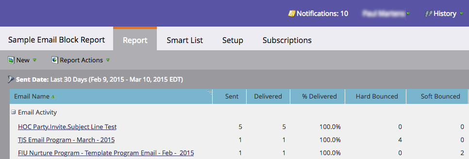

# Hard and Soft Bounces in Email {#hard-and-soft-bounces-in-email}

A hard bounce can render a person's email address invalid when a mail server tells Marketo that the person's email can't be delivered. A soft bounce means something went wrong in delivering the email to the person; this automatically gets resolved and can sometimes takes days. Both hard and soft bounces consist of [multiple categories](https://nation.marketo.com/docs/DOC-2752).

>[!NOTE]
>
>**FYI**
>
>Marketo is now standardizing language across all subscriptions, so you may see lead/leads in your subscription and person/people in docs.marketo.com. These terms mean the same thing; it does not affect article instructions. There are some other changes, too. [Learn more](http://docs.marketo.com/display/DOCS/Updates+to+Marketo+Terminology).

#### Bounce Classification {#bounce-classification}

There are 5 person strings in Marketo that are related to troubled email delivery.

1. **Email Suspended** - Set to True when a certain type of hard bounce occurs.
1. **Email Suspended Cause** - There can be many reasons. This field tries to explain the cause.
1. **Email Suspended At **- When the offending bounce occurs, Marketo will suspend mailing to the person for 24 hours from this timestamp.
1. **Email Invalid** - Set to True when a certain type of hard bounce occurs.
1. **Email Invalid Cause** - The reason for the hard bounce.

>[!NOTE]
>
>After a person reaches **email suspended** status, there is no way to clear the email suspended checkbox. However, the person will still become mailable 24 hours after the initial suspension.
>
>When a person is marked as **email invalid**, they can only be reset manually (which we recommend you only do if you know for certain their email is valid) by unchecking the "Email Invalid" box in the Person Info tab of their record.

>[!NOTE]
>
>**Prerequisites**
>
>Follow [these steps](../../../product-docs/email-marketing/email-programs/email-program-data/email-performance-report.md) to create an Email Performance Report, which will generate bounce data.

After creating your Email Performance Report, your screen should look something like this: 

>[!NOTE]
>
>Spam filters sometimes create hard bounces. These "false-positives" are not an indication of the true validity of the person's email address.

