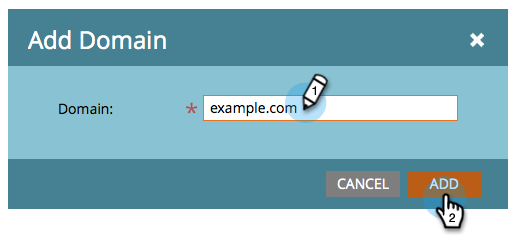
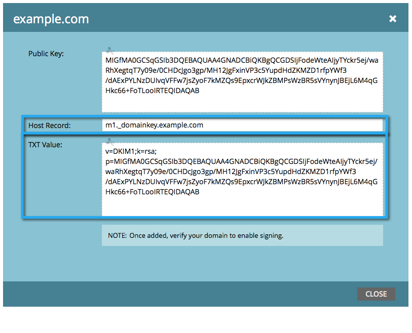
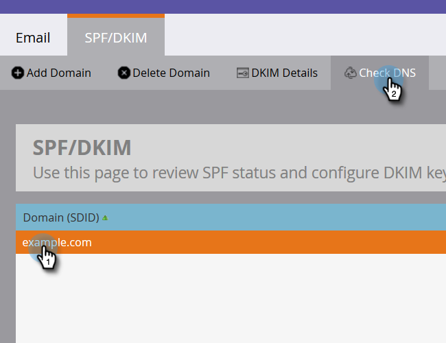

# Set up a Custom DKIM Signature {#set-up-a-custom-dkim-signature}

In order to ensure top-notch deliverability, we automatically sign all outbound mail with a shared Marketo DKIM signature.

>[!NOTE]
>
>You may need the help of your IT team to complete some of the steps in this article.

You can personalize the DKIM signature to reflect the domain(s) of your choice. Here's how.

1. Go to the **Admin** section.

   

   >[!NOTE]
   >
   >If you set up a custom DKIM signature the old-fashioned way, it will continue to work and should show up here.

1. Click **Email**, then the **DKIM** tab, and finally **Add Domain**.

   

1. Enter the domain you will be using in Marketo emails as the From Address and click **Add**.

   >[!TIP]
   >
   >If you use a different domain in your From Address, we will use the Marketo shared DKIM signature.

   

1. Send the **Host Record** and **TXT Value** to your IT. Ask them to create the record for you and make sure it propagates to all nameservers associated with the from domain. Marketo's DKIM verification requires that the DKIM key is propagated to all nameservers associated with the domain being DKIM-signed.

   

1. Once they confirm they've created the record, come back to Marketo, select your domain, and click **Check DNS**.

   

   >[!NOTE]
   >
   >If the confirmation fails and your IT has created the record correctly, it may be a matter of DNS propagation. Try again later.

   >[!CAUTION]
   >
   >Modifying/removing the corresponding DNS record will result in harmed deliverability. Make sure to delete the entry in Marketo before making DNS changes.

   This will absolutely help with your email deliverability. You should get validation that the record is there and correct.
