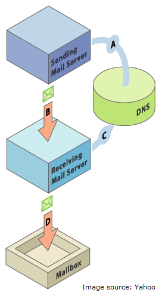

# Set up SPF and DKIM for your Email Deliverability {#set-up-spf-and-dkim-for-your-email-deliverability}

One quick method to improve your email delivery rates is to incorporate **SPF** (Sender Policy Framework) and **DKIM** (Domain Keys Identified Mail) into your DNS settings. With this addition to your DNS entries, you're telling recipients that you've authorized Marketo to send emails on your behalf. Without this change, your email has a higher chance of being marked as spam since the email was addressed from your domain, but sent from an IP address with a Marketo domain.

>[!CAUTION]
>
>You'll need your network administrator to make this change in your DNS record.

## Set up SPF {#set-up-spf}

**If you DON'T have an SPF record on your domain**

Ask your network admin to add the following line to your DNS entries. Replace [domain] with the main domain of your website (ex. "company.com") and [corpIP] with the IP address of your corporate email server (ex. "255.255.255.255"). If you send emails from multiple domains through Marketo, you should add this to each domain (on one line).

`[domain] IN TXT v=spf1 mx ip4:[corpIP] include:mktomail.com ~all`

**If you DO have an SPF record on your domain**

If you already have an SPF record in your DNS entry, add the following to it:

include:mktomail.com

## Set up DKIM {#set-up-dkim}

**What is DKIM? Why do I want to set up DKIM?**

DKIM is an authentication protocol that is used by email receivers to determine if an email message was sent by who it says it was sent by. DKIM often improves deliverability of emails to the inbox since a receiver can be confident that the message is not a forgery.

**How does DKIM work?**

After you set up the public key in your DNS record and activate the sending domain in the Admin section (A), we will turn on custom DKIM signing for your outgoing messages, which will include an encrypted digital signature with each email we send out for you (B). The receivers will be able to decrypt the digital signature by looking up the "public key" in your sending domain's DNS (C). If the key in the email corresponds with the key in your DNS record, the receiving mail server will be more likely to accept the email Marketo sent on your behalf.

**How do I set up DKIM?**

Please refer to [Set up a Custom DKIM Signature](/help/marketo/product-docs/email-marketing/deliverability/set-up-a-custom-dkim-signature.md).

>[!MORELIKETHIS]
>
>* [Learn More About SPF and How it Works](http://www.open-spf.org/Introduction/)
>* [Marketo's Email Deliverability Tools](https://www.marketo.com/software/email-marketing/email-deliverability/)
>* [Is My SPF Set Up Correctly?](https://www.kitterman.com/spf/validate.html)
>* [Did I Use the Right Syntax?](http://www.open-spf.org/SPF_Record_Syntax/)
