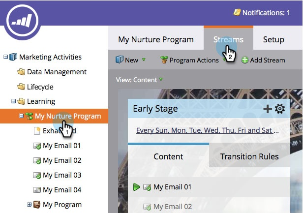
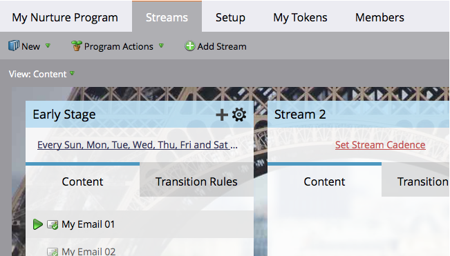

# Add a Stream {#add-a-stream}

Engagement programs can hold more than one stream. Here's how to add a new one.

1. Go to **Marketing Activities**.

   

1. Select your engagement program and click the **Streams** tab.

   

1. Click **Add Stream**.

   

   >[!NOTE]
   >
   >You can add up to 25 streams per engagement program.

   And... done!

   
