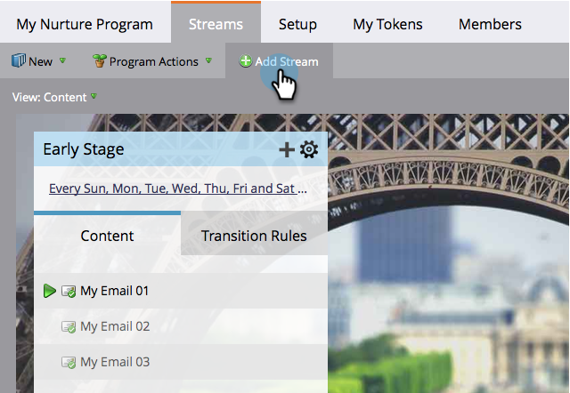
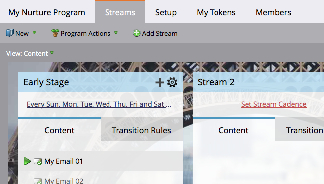

# Add a Stream {#add-a-stream}

Engagement programs can hold more than one stream.

1. Go to **[!UICONTROL Marketing Activities]**.

   

1. Select your engagement program and click the **[!UICONTROL Streams]** tab.

   

1. Click **[!UICONTROL Add Stream]**.

   

   >[!NOTE]
   >
   >You can add up to 25 streams per engagement program.

   
