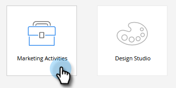
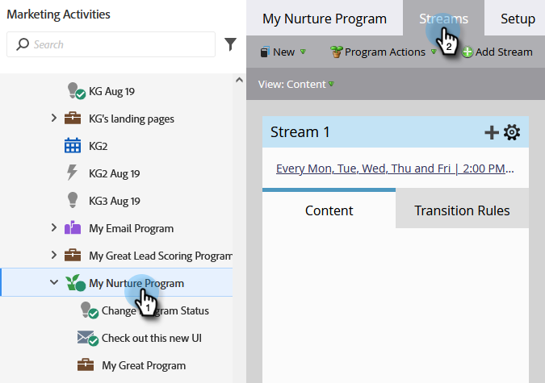
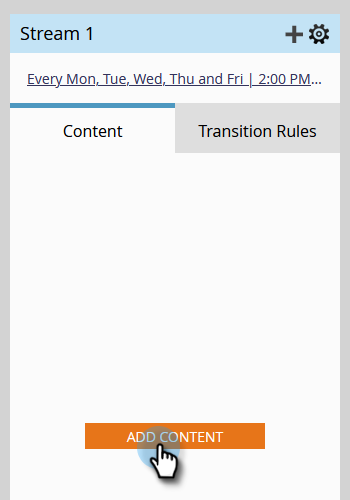
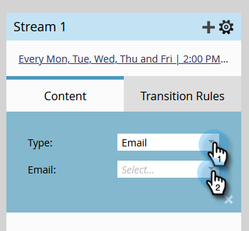
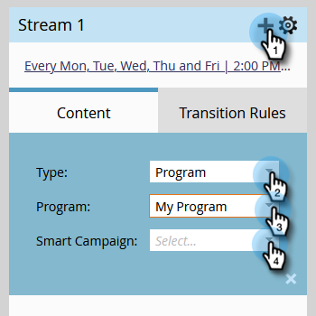

# Add Content to a Stream {#add-content-to-a-stream}

Once you've created your engagement program, you need to add content to the stream(s). You can add emails or programs to a stream.

1. Go to **[!UICONTROL Marketing Activities]**.

   

1. Select your engagement program and go to the **[!UICONTROL Streams]** tab.

   

   You can add content two different ways:

**Add Content Button**

1. Click the **[!UICONTROL Add Content]** button.

   

1. Choose **[!UICONTROL Email]** _or_ **[!UICONTROL Program]**, then select the email or program/smart campaign you want to add.

   

   >[!TIP]
   >
   >Emails local to this engagement program will be sorted on top.

**+ Icon**

1. Click the **+** icon, choose **[!UICONTROL Email]** _or_ **[!UICONTROL Program]**, then select the email or program/smart campaign you want to add.

   

   >[!NOTE]
   >
   >A smart campaign must contain the **[!UICONTROL Member of Engagement Program]** filter for it to work properly.

Great job! You now know how to add content to your program streams. Add as much as you need for your nurture. See the related article below for more details.

>[!MORELIKETHIS]
>
>[Adding a Program to an Engagement Program Stream](/help/marketo/product-docs/email-marketing/drip-nurturing/creating-an-engagement-program/adding-a-program-to-an-engagement-program-stream.md)
