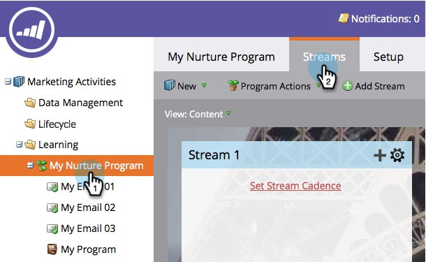
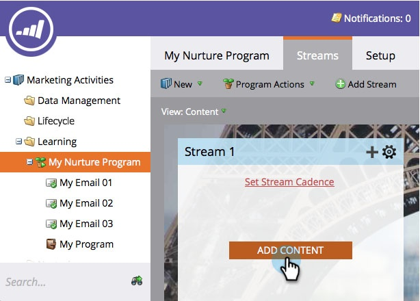
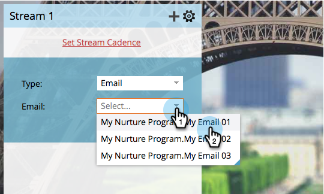
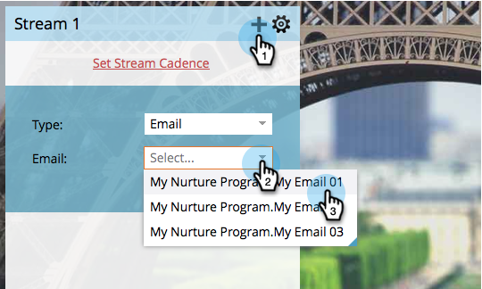
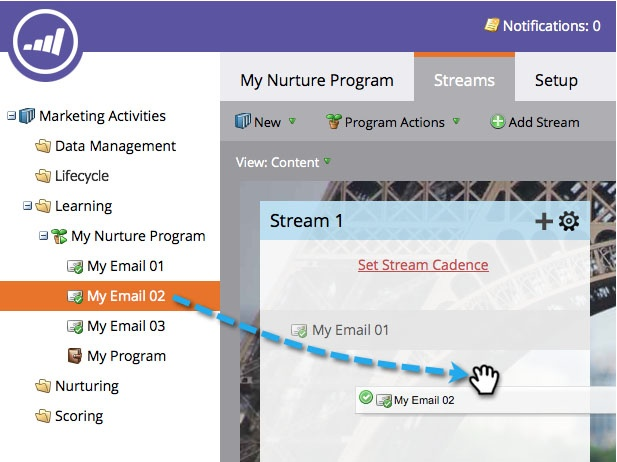
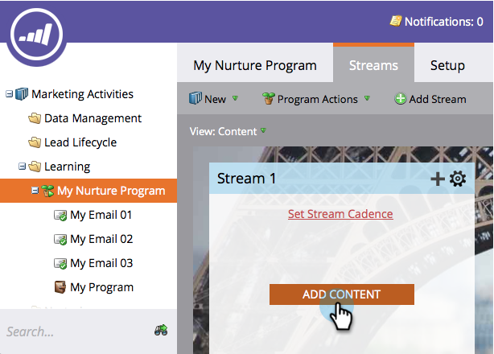
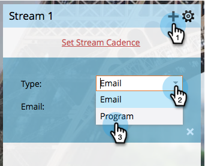
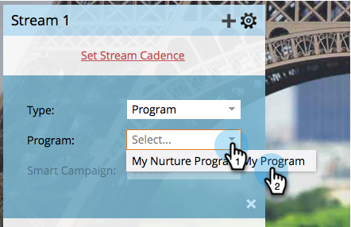
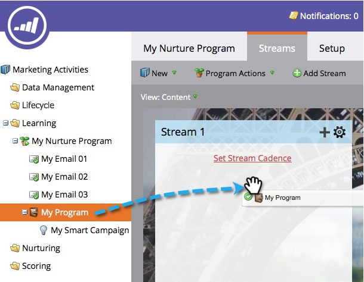

# Add Content to a Stream {#add-content-to-a-stream}

Once you've created your engagement program, you need to add content to the stream(s). You can add emails or programs to a stream.

## Add an Email to a Stream {#add-an-email-to-a-stream}

1. Go to **Marketing Activities**.

   

1. Select your engagement program and go to the **Streams** tab.

   

   You can add the first email in three different ways:

**Add Content Button**

1. Click the **Add Content** button.

   

1. Leave the **Type** set to **Email**, then select the email you want to add.

   

   >[!TIP]
   >
   >Emails local to this engagement program will be sorted on top.

**Stream + Icon**

1. Click the streams **+** icon, leave **Type** as **Email**, and select the email you want to add.

   

**Drag & Drop**

1. Simply drag the email from the tree into the stream.

   

## Add a Program to a Stream {#add-a-program-to-a-stream}

1. Go to **Marketing Activities**.

   

1. Select your engagement program and go to the **Streams** tab.

   

   You can add a program to your stream in three different ways:

**Add Content Button**

1. Click **Add Content**.

   

1. Change **Type** to Program.

   

1. Find and select the program.

   

1. Now pick the smart campaign in the program you want people to run through.

   

   >[!NOTE]
   >
   >The smart campaign must have the **Member of Engagement Program** filter in it for this to work properly.

**Stream + Icon**

1. Click the stream **+** icon, then change **Type** to Program.

   

1. Find and select your program.

   

1. Select the smart campaign you want the people to be processed in.

   

**Drag & Drop**

1. Drag and drop the program of your choice from the tree into your stream.

   

1. Now just pick the smart campaign you want people to flow through.

   

Great job! You now know different ways of adding content to your program streams. Add as many as you need for your nurture. See the related article below for more details.

>[!MORELIKETHIS]
>
>[Adding a Program to an Engagement Program Stream](/help/marketo/product-docs/email-marketing/drip-nurturing/creating-an-engagement-program/adding-a-program-to-an-engagement-program-stream.md)
