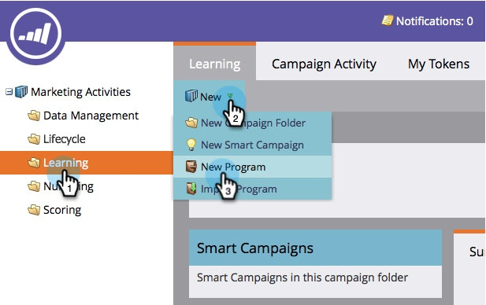
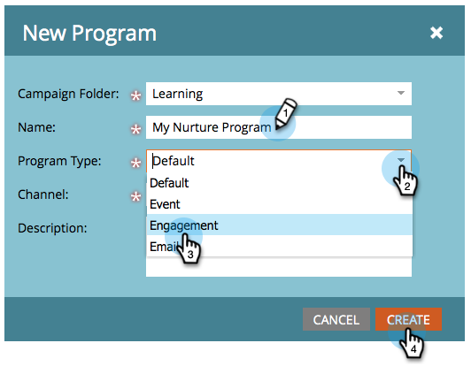

# Create an Engagement Program {#create-an-engagement-program}

You can use engagement programs in Marketo to accomplish email nurturing with ease.

1. Go to **Marketing Activities**.

   

1. Select the folder you want to create the engagement program in, then click **New** and **New Program**.

   

1. Enter a **Name**, select **Engagement** for **Program Type** and click **Create**.

   

1. Alright, now that you have an engagement program, let's move forward and dress it up.

   

   >[!MORELIKETHIS]
   >
   >* [Add Content to a Stream](/help/marketo/product-docs/email-marketing/drip-nurturing/creating-an-engagement-program/add-a-stream.md)
   >* [Set Stream Cadence](/help/marketo/product-docs/email-marketing/drip-nurturing/engagement-program-streams/set-stream-cadence.md)
