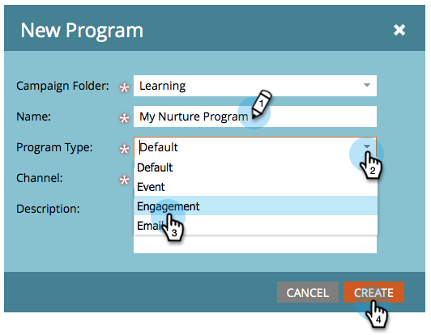
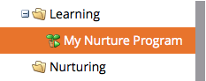

# Create an Engagement Program {#create-an-engagement-program}

You can use engagement programs in Marketo to accomplish email nurturing with ease.

1. Go to **[!UICONTROL Marketing Activities]**.

   

1. Select the folder you want to create the engagement program in, then click **[!UICONTROL New]** and **[!UICONTROL New Program]**.

   

1. Enter a **[!UICONTROL Name]**, select **[!UICONTROL Engagement]** for **[!UICONTROL Program Type]** and click **[!UICONTROL Create]**.

   

   

   >[!MORELIKETHIS]
   >
   >* [Add Content to a Stream](/help/marketo/product-docs/email-marketing/drip-nurturing/creating-an-engagement-program/add-content-to-a-stream.md)
   >* [Set Stream Cadence](/help/marketo/product-docs/email-marketing/drip-nurturing/engagement-program-streams/set-stream-cadence.md)
