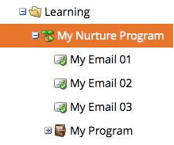
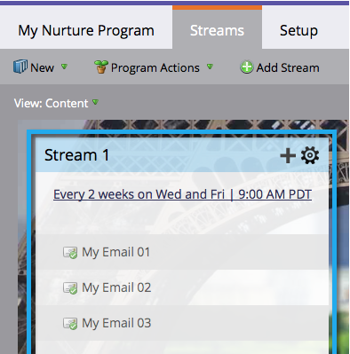
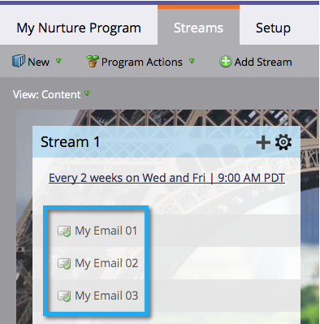
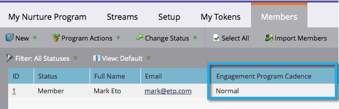
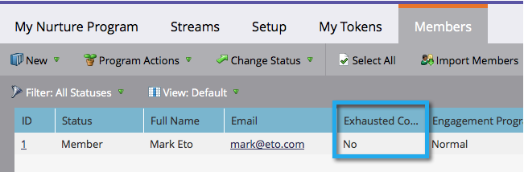

# Understanding Engagement Programs {#understanding-engagement-programs}

Engagement programs are designed to market to new people by presenting content to them in a systematic way.

>[!NOTE]
>
>**FYI**
>
>Marketo is now standardizing language across all subscriptions, so you may see lead/leads in your subscription and person/people in docs.marketo.com. These terms mean the same thing; it does not affect article instructions. There are some other changes, too. [Learn more](http://docs.marketo.com/display/DOCS/Updates+to+Marketo+Terminology).

>[!NOTE]
>
>There is a limit of 100 **active** engagement programs per subscription.

## Engagement Program {#engagement-program}

An **engagement pr****ogram** is a type of program that can accomplish complex nurturing with ease.

Related Article:

* [Create an Engagement Program](create-an-engagement-program.md)

## Stream {#stream}

A **stream** is a pool of prioritized content that the engagement program will use to nurture people.

Related Articles:

* [Add a Stream](add-a-stream.md)
* [Clone a Stream](../../../../product-docs/email-marketing/drip-nurturing/engagement-program-streams/clone-a-stream.md)

## Content {#content}

There are two types of **content** you can add to engagement program streams—emails and programs. Emails will be sent to people at cast time.

Related Articles:

* [Add Content to a Stream](add-content-to-a-stream.md)
* [Prioritize Stream Content](../../../../product-docs/email-marketing/drip-nurturing/using-stream-content/prioritize-stream-content.md)
* [Edit Availability of Stream Content](../../../../product-docs/email-marketing/drip-nurturing/using-stream-content/edit-availability-of-stream-content.md)
* [Remove Stream Content](../../../../product-docs/email-marketing/drip-nurturing/using-stream-content/remove-stream-content.md)
* [Archive and Unarchive Stream Content](../../../../product-docs/email-marketing/drip-nurturing/using-stream-content/archive-and-unarchive-stream-content.md)

## Cast {#cast}

A **cast** is the event of sending emails from an Engagement Program.

>[!NOTE]
>
>Engagement Programs are not designed to be used with operational emails.

## Stream Cadence {#stream-cadence}

You decide when a cast happens by setting up **stream cadence**. This is how you schedule content to go out at regular intervals.

` 

`

Related Article:

* [Set Stream Cadence](../../../../product-docs/email-marketing/drip-nurturing/engagement-program-streams/set-stream-cadence.md)

## Person Cadence {#person-cadence}

A **person cadence** is a status that defines its ability to receive content from an engagement program. You can use the **Change Engagement Program Cadence** flow step to change this to Paused or Normal.

` 

`

## Exhausted {#exhausted}

Once a person has received every piece of content in a stream, we call the person **Exhausted**.

>[!NOTE]
>
>**Related Articles**
>
>* [People Who Have Exhausted Content](../../../../product-docs/email-marketing/drip-nurturing/using-engagement-programs/people-who-have-exhausted-content.md)
>

## Content Engagement Level {#content-engagement-level}

Content Engagement Level is a 0 to 100 point score that Marketo will give your content. This number is determined by a sophisticated formula using opens, clicks, unsubscribes, program success, and other factors.

>[!NOTE]
>
>**Related Articles**
>
>* [Understanding the Engagement Score](../../../../product-docs/email-marketing/drip-nurturing/reports-and-notifications/understanding-the-engagement-score.md)
>

