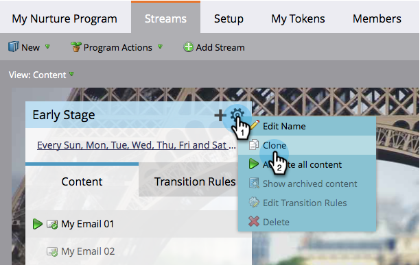

# Clone a Stream {#clone-a-stream}

Clone a stream for various reasons, including testing different orders and different cadences.

1. Select your engagement program and go to the **[!UICONTROL Streams]** tab.

   

1. Click on the stream gear icon then click **[!UICONTROL Clone]**.

   

   >[!NOTE]
   >
   >You can have up to 25 streams per engagement program.

   Nicely done! Don't you love things that make your life easier?  

   

   >[!CAUTION]
   >
   >Everything in the stream is cloned except for the Cadence. Remember to set it.
